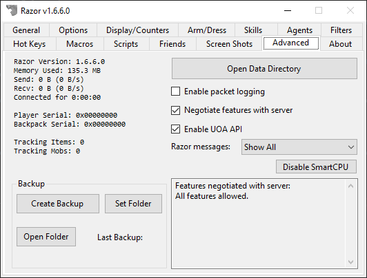

# Advanced

This tab will show some data regarding Razor internals and give you a few options. The data on the left is purely for informational purposes only.

## Options

* **Open Data Directory**
    * Opens Windows Explorer to the folder containing your profiles and macros.
* **Enable packet logging**
    * This feature will save all packets flowing between the UO client and server. Useful for debugging purposes but when enabled can slow down Razor and eventually cause a large file to be created if not disabled.
* **Negotiate features with server**
    * This allows Razor to communicate with the server to enable/disable certain features in Razor. When this box is not checked, Razor will fail to respond to a negotiation packet and you will subsequently be disconnected from the server you are connected to.
 * * **Enable UOA API**
    * This opens up a limited API that can be used by 3rd party applications (such as various mapping tools) to get some data from Razor.

## Disable SmartCPU

SmartCPU has been completely removed from this version, but the option to disable it remains in place in case it was enabled in an older version.
