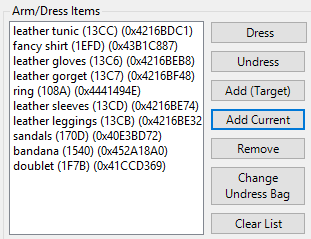

# Arm / Dress

The Arm/Dress tab is for setting clothes, armor and weapons for use. These settings are used with hotkeys.

## Arm/Dress Selection

This is the list of arm/dresses can consist of a complete outfit or just one item. Hotkeys can be assigned to each. Use the **Add** and **Remove** buttons to manage.

* **Automatically move conflicting items**
    - Check this box so Razor can dress you properly. This allows items to be removed when neccesary. For example, you are equiped with a halberd and hit your hotkey to equip a war axe. With this box checked, Razor can un-equip the halberd to equip the war axe. This will apply to all lists and hotkeys.

## Arm/Dress Items

This is where you define the items for each list created above. Highlight a list from the left and use the following tabs to set it up. Any entries can be right-clicked for conversion to 'Dress by Type'.

>> ***Note:** 'Dress by type' will tell Razor to look for any item of that type to use, not only the specific item used to set the list. This is most useful for weapons.*

* **Dress**
    - Highlight a list from the left and click this tab to dress in the items from that list.
* **Undress**
    - Highlight a list from the left and click this tab to undress the items from that list.
* **Add (Target)**
    - Click this tab to add items to a list. You will get a targeting cursor to target the item to be added.
* **Add Current**
    - Adds everything currently being worn to the highlighted list.
* **Remove**
    - Highlight an item and click 'Remove' to delete an item from the list.
* **Clear List**
    - Clear the current list.
* **Change Undress Bag**
    - Gives a targeting cursor. Target the bag you want to undress to.