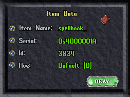
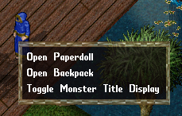

# Command Overview

The commands issued in the scripting engine are similar to commands you might enter into a command prompt or shell.  Each line has a starting command and a set of parameters.  Some of those parameters are required, some are optional.

`command (required) [optional]`

All parameters are shown inside of parenthesis or brackets.  Parameters within parenthesis are **required** while those in brackets are _optional_ and will default to specific value if not provided.

If you want to pass several words as a single parameter you must wrap them using `'` or `"`. For example `'hello goodbye'` is one parameter, while `hello` `goodbye` is two.

For example, if your script is something like:

```razor
# Say 'Hello'
say Hello friends!
```

You will end up just saying `Hello`.  Instead, you if you wrap the words in single (') or double quotes (") the engine will see it as a single parameter.

```razor
# Say 'Hello friends!'
say 'Hello friends!'
```

If you prefix a command with the `@` this will silence any warning/output from the command.  For example:

!!! example

    ```razor
    // Generate warning if robe is out of reach
    lifttype 'robe'

    // Silence warning if robe is out of reach
    @lifttype 'robe'
    ```

Without the `@` symbol, if a robe isn't available, you would get an warning message telling you that it couldn't find a robe. But since the `@` symbol was provided, no warning is displayed.

# Action Commands

## attack

**Syntax**: `attack (serial)` or `attack ('variablename')`

**Description**: Attack a specific serial or variable tied to a serial.

!!! example

    === "Attack Target"

        ```razor
        attack '0x21B4'
        ```

    === "Attack Variable"

        ```razor
        attack 'attackdummy'
        ```
## cast

**Syntax**: `cast ('name of spell')`

**Description**: Cast a spell by name

!!! example

    === "Cast specific spell"

        ```razor
        cast 'greater heal'
        wft
        target 'self'
        ```

## classicuo

**Syntax**: `classicuo ('setting') ('value')` or `cuo ('setting') ('value')`

**Description**: This command will change specific settings/properties in your current ClassicUO profile.

!!! tip
    Type `>cuo list` to get a list of profile settings/properties to change

!!! example

    === "Turn off CUO music"

        ```razor
        overhead 'Turn off the music!'
        classicuo 'enablemusic' false
        ```

    === "Adjust music volume to 50%"

        ```razor
        overhead 'Turning music to 50%'
        classicuo 'musicvolume' 50
        ```

## cleardragdrop

**Syntax**: `cleardragdrop`

**Description**: Clears Razor's the drag/drop queue

!!! example

    === "Clear on sysmsg message"

        ```razor
        if insysmsg 'cannot reach'
            cleardragdrop
        endif
        ```

## clearhands

**Syntax**: `clearhands ('left'/'right'/'both')`

**Description**: Undress your hands based on the param.

!!! example

    === "Undress both hands"

        ```razor
        clearhands 'both'
        ```

    === "Undress left hand"

        ```razor
        clearhands 'left'
        ```

## cooldown

**Syntax**: `cooldown ('name') ('seconds') ['hue'] ['icon name'] ['sound'] ['stay visible'] ['foreground color'] ['background color']`

**Description**: This command will add a custom cooldown that will display as a gump in-game.

??? tip "Supported Foreground & Background Colors"
    You can set the foreground and background color of the specific cooldown down by using one of the colors below:

    > AliceBlue, AntiqueWhite, Aqua, Aquamarine, Azure, Beige, Bisque, Black, BlanchedAlmond, Blue, BlueViolet, Brown, BurlyWood, CadetBlue, Chartreuse, Chocolate, Coral, CornflowerBlue, Cornsilk, Crimson, Cyan, DarkBlue, DarkCyan, DarkGoldenrod, DarkGray, DarkGreen, DarkKhaki, DarkMagenta, DarkOliveGreen, DarkOrange, DarkOrchid, DarkRed, DarkSalmon, DarkSeaGreen, DarkSlateBlue, DarkSlateGray, DarkTurquoise, DarkViolet, DeepPink, DeepSkyBlue, DimGray, DodgerBlue, Firebrick, FloralWhite, ForestGreen, Fuchsia, Gainsboro, GhostWhite, Gold, Goldenrod, Gray, Green, GreenYellow, Honeydew, HotPink, IndianRed, Indigo, Ivory, Khaki, Lavender, LavenderBlush, LawnGreen, LemonChiffon, LightBlue, LightCoral, LightCyan, LightGoldenrodYellow, LightGray, LightGreen, LightPink, LightSalmon, LightSeaGreen, LightSkyBlue, LightSlateGray, LightSteelBlue, LightYellow, Lime, LimeGreen, Linen, Magenta, Maroon, MediumAquamarine, MediumBlue, MediumOrchid, MediumPurple, MediumSeaGreen, MediumSlateBlue, MediumSpringGreen, MediumTurquoise, MediumVioletRed, MidnightBlue, MintCream, MistyRose, Moccasin, NavajoWhite, Navy, OldLace, Olive, OliveDrab, Orange, OrangeRed, Orchid, PaleGoldenrod, PaleGreen, PaleTurquoise, PaleVioletRed, PapayaWhip, PeachPuff, Peru, Pink, Plum, PowderBlue, Purple, RebeccaPurple, Red, RosyBrown, RoyalBlue, SaddleBrown, Salmon, SandyBrown, SeaGreen, SeaShell, Sienna, Silver, SkyBlue, SlateBlue, SlateGray, Snow, SpringGreen, SteelBlue, Tan, Teal, Thistle, Tomato, Transparent, Turquoise, Violet, Wheat, White, WhiteSmoke, Yellow, YellowGreen

??? tip "Supported Icon Names"
    You can use any of the following icons.

    **NOTE:** Icon availability is based on the version of the client you have. If the icon doesn't display, it must be an icon that doesn't exist your data files.

    > AchievePerfection, ActiveMeditation, Agility, AnimalForm, AnticipateHit, ArcaneEmpowerment, ArchProtection, ArmorPierce, AttuneWeapon, AuraOfNausea, BarakoDraftOfMight, BarrabHemolymphConcentrate, Berserk, Bleed, Bless, Block, BloodOathCaster, BloodOathCurse, BloodwormAnemia, Boarding, Bodyguard, BoneBreaker, BoneBreakerImmune, CaddelliteInfused, CalledShot, CityTradeDeal, Clumsy, CombatTraining, Conduit, Confidence, ConsecrateWeapon, CorpseSkin, CounterAttack, CriminalStatus, Cunning, Curse, CurseWeapon, DeathRay, DeathRayDebuff, DeathStrike, DefenseMastery, DespairCaster, DespairTarget, Disarm, Disguised, DivineFury, DragonTurtleDebuff, DualWield, ElementalFury, ElementalFuryDebuff, Enchant, EnchantedSummoning, EnemyOfOne, EnemyOfOneDebuff, EssenceOfWind, EtherealBurst, EtherealVoyage, Evasion, EvilOmen, FactionStatLoss, FanDancerFanFire, FeebleMind, Feint, FeintDebuff, FishPie, FistsOfFury, Fly, FocusedEye, ForceArrow, GazeDespair, GiftOfLife, GiftOfRenewal, GrapesOfWrath, Healing, HeatOfBattleStatus, HeightenedSenses, HidingAndOrStealth, HiryuPhysicalResistance, HitLowerAttack, HitLowerDefense, HonorableExecution, Honored, HonoredDebuff, HorrificBeast, HowlOfCacophony, Humility, HumilityDebuff, ImmolatingWeapon, Incognito, InjectedStrike, InjectedStrikeDebuff, Inspire, Intuition, Invigorate, Invisibility, JukariBurnPoiltice, Knockout, KurakAmbushersEssence, LichForm, LightningStrike, MagicReflection, ManaPhase, ManaShield, MassCurse, MassSleep, MedusaStone, Mindrot, MomentumStrike, MortalStrike, MysticalPolymorphTotem, MysticWeapon, NightSight, Onslaught, OrangePetals, PainSpike, Paralyze, Perfection, Perseverance, Pierce, PlayingTheOdds, PlayingTheOddsDebuff, Poison, PoisonImmunity, Polymorph, Potency, PotionGloriousFortune, Protection, PsychicAttack, Rage, RageFocusingBuff, RageFocusingDebuff, Rampage, ReactiveArmor, ReaperForm, Resilience, RoseOfTrinsic, RotwormBloodDisease, RuneBeetleCorruption, SakkhraProphylaxis, SavingThrow, Shadow, ShieldBash, SkillUseDelay, Sleep, Sparks, SpellFocusingBuff, SpellFocusingDebuff, SpellPlague, Spirituality, SplinteringEffect, Stagger, StoneForm, Strangle, Strength, Surge, Swarm, SwarmImmune, SwingSpeedDebuff, TalonStrike, Thrust, ThrustDebuff, Thunderstorm, Tolerance, Toughness, TribulationCaster, TribulationTarget, TrueFear, UnknownGoblin, UnknownRedDrop, UnknownStar, UnknownTomato, UraliTranceTonic, VampiricEmbrace, Veterinary, Warcry, Warding, Weaken, Webbing, Whispering, WhiteTigerForm, WraithForm    

!!! example

    === "Simple cooldown"

        ```razor
        cooldown 'Refresh' 20
        ```

    === "Cooldown with custom hued text"

        ```razor
        cooldown 'Refresh' 20 234
        ```

    === "Cooldown with icon"

        ```razor
        cooldown 'Refresh' 15 0 'Agility'
        ```

    === "Cooldown a custom sound (flute)"

        ```razor
        cooldown 'Health Check' 20 0 0 61
        ```

    === "Cooldown remains when expired"

        ```razor
        # default cooldown, 20 seconds, remains after it expires
        cooldown 'Health Check' 20 0 0 0 true

        # default cooldown, 25 seconds, 235 hue, icon 30012, no sound, remains after it expires
        cooldown 'Health Check' 20 235 30012 0 true
        ```

    === "Cooldown with custom colors"

        ```razor
        cooldown 'Stay 1' 20 0 0 0 false 'Firebrick' 'Peru'
        ```

    === "Reset existing cooldown"

        ```razor        
        cooldown 'Refresh' 20

        wait 10 seconds

        cooldown 'Refresh' 20
        ```

## dclick

**Syntax**: `dclick (serial)` or `dclick ('left'/'right'/'hands')`

**Description**: This command will use (double-click) a specific item or mobile or use the item in one of your hands using `left`, `right` or `hands` to use an item in either hand.

!!! example

    === "Double-click a specific item id"

        ```razor
        dclick '0x34AB'
        ```

    === "Double-click a variable"

        ```razor
        dclick 'myvariable'
        ```

    === "Double-click any item in your hands"
        ```razor
        dclick 'hands'
        ```
    
    === "Double-click item in right hand"
        ```razor
        dclick 'right'
        ```

## dclicktype

**Syntax**: `dclicktype ('name of item'/'graphicId') [inrange (true/false)/backpack] [hue]`

**Description**: This command will use (double-click) an item type either provided by the name or the graphic ID.

!!! tip "Range Check"
    If you include the optional `true` parameter, items within range (2 tiles) will only be considered. If you include the optional `backpack` parameter, items in your backpack only be considered.

!!! tip "Getting the graphic name or ID"
    To get the name or the ID of item, use the `>info` command in Razor and click on the item. You can use either the `Item Name` or `Id`.

    

!!! example

    === "Use any item"

        ```razor
        dclicktype 'dagger'
        waitfortarget
        targettype 'robe'
        ```

    === "..with range check"

        ```razor hl_lines="1"
        dclicktype 'dagger' true
        waitfortarget
        targettype 'robe' true
        ```

    === "..with backpack only"

        ```razor hl_lines="1"
        dclicktype 'dagger' backpack
        waitfortarget
        targettype 'robe' backpack
        ```

    === "..with backpack and hue only"

        ```razor hl_lines="1"
        dclicktype 'dagger' backpack 45
        waitfortarget
        targettype 'robe' backpack
        ```

## dress

**Syntax**: `dress ('name of dress list')` or `dress (serial)`

**Description**: This command will execute a spec dress list you have defined in Razor or dress (left and drop) a specific serial

!!! example

    === "Use existing dress list"

        ```razor
        dress 'My Sunday Best'
        ```
    
    === "Using a serial"

        ```razor hl_lines="1"
        dress '0x345234'
        ```

    === "Using a variable"

        ```razor hl_lines="2"
        setvar 'hat'
        dress 'hat'
        ```

## drop

**Syntax**: `drop (serial) (x) (y) [z]` or `drop (serial) (layer)` or `drop 'ground' (x) (y) [z]`

**Description**: This command will drop the item you are holding either at your feet, on a specific layer , at a specific X/Y/Z location on the ground or within the defined serial.

!!! tip
    The functionality of `drop 'ground' (x) (y) [z]` is also available in with [droprelloc](./#droprelloc).

!!! tip
    A list of available [layers](./layers.md) for reference that can be used with this command.

!!! example

    === "Lift item, drop on your chest/torso"

        ```razor
        lift '0x400D54A7'
        drop 'self' InnerTorso
        ```

    === "Lift item, drop on ground at location"

        ```razor
        lift '0x400D54A7'
        drop 'ground' 5926 1148 0
        ```

## droprelloc

**Syntax**: `droprelloc (x) (y)`

**Description**: This command will drop the item you're holding to a location relative to your position.

Example:

!!! example

    === "Drop Relative Location"

        ```razor
        lift '0x400EED2A'
        wait 1000
        droprelloc 1 1
        ```

## getlabel

**Syntax**: `getlabel ('serial') ('variable name')`

**Description**: This command will get the label (text obtained by single-clicking an item) and save it to a variable.

!!! example

    === "Find a dog"

        ```razor
        if findtype '217' as 'a_dog'
            getlabel 'a_dog' 'dog_label'

            if 'Fido' in 'dog_label'
                overhead 'found mydog!' 5
                overhead 'dog_label' 67
            endif    
        endif
        ```

    === "Find a silver kryss"

        ```razor        
        setvar 'silver_bag'

        if findtype '0x140' as 'kryss'
            getlabel 'kryss' 'kryss_label'

            if 'silver' in 'kryss_label'
                overhead 'found silver kryss!' 5
                
                lift 'kryss' 1
                drop 'silver_bag' -1 -1 0
            endif    
        endif
        ```

## hotkey

**Syntax**: `hotkey ('name of hotkey')`

**Description**: This command will execute any Razor hotkey by name.

!!! example

    === "Hotkey"

        ```razor
        skill 'detect hidden'
        waitfortarget
        hotkey 'target self'
        ```

## interrupt

**Syntax**: `interrupt ['layer']`

**Description**: This command will interrupt a casting action. You can pass an [optional layer](layers.md) if you want interrupt to only attempt an interrupt using a specific layer.

!!! tip
    If you don't provide a specific layer to use for interrupt, Razor will search in the following order:

    `shirt, shoes, pants, head, gloves, ring, neck, waist, innertorse, bracelet, middletorso, earrings, arms, cloak, outertorso, outerlegs, innerlegs, righthand, lefthand`

!!! example

    === "Example"

        ```razor
        cast 'energy bolt'
        if hp < 10
            interrupt
            cast 'greater healing'
            wft
            target 'self'
        else
            wft
            target 'last'    
        endif        
        ```

    === "Specific layer"

        ```razor hl_lines="3"
        cast 'energy bolt'
        if hp < 10
            interrupt 'pants'
            cast 'greater healing'
            wft
            target 'self'
        else
            wft
            target 'last'    
        endif 
        ```

## lift

**Syntax**: `lift ('serial') ['amount'] ['timeout']`

**Description**: This command will lift a specific item and amount. If no amount is provided, `1` is set as default. If no timeout is provided, `30000` (30 seconds) is set as default

!!! tip "dress command"
    If you're looking to lift an item to wear, consider using the `dress` command instead.

!!! example

    === "Lift item and drop to the ground"

        ```razor
        lift '0x400EED2A'
        wait 1000
        droprelloc 1 1 0
        ```

    === "Lift item, timeout in 5 seconds if unable"
        
        ```razor       
        lift '0x400EED2A' 1 5000
        droprelloc 1 1 0
        ```

## lifttype

**Syntax**: `lifttype ('gfx') ['amount'] ['hue']` or `lifttype ('name of item') ['amount'] ['hue']`

**Description**: This command will lift a specific item by type either by the graphic id or by the name from your backpack. If no amount is provided, `1` is defaulted.

!!! example

    === "Lift by name"

        ```razor
        lifttype 'robe'
        wait 1000
        droprelloc 1 1
        ```

    === "Lift by item id"

        ```razor
        lifttype '0x1FCD'
        wait 1000
        droprelloc 1 1
        ```

    === "Lift by name, max 5"

        ```razor
        lifttype 'fish steak%s%' 5
        wait 1000
        droprelloc 1 1
        ```

    === "Lift by name, max 5, specific hue"

        ```razor
        lifttype 'fish steak%s%' 5 45
        wait 1000
        droprelloc 1 1
        ```

## music

**Syntax**: `music ('index')`

**Description**: This command will play music based on the ID.

!!! tip
    The music ID can often be found in `Music\Digital\Config.txt` in the main client files.

!!! example

    === "Description"

        ```razor hl_lines="3"
        overhead 'playings bucsden'
        wait 500
        music 11
        ```

## potion

**Syntax**: `potion ('potion type')`

Types: `heal, cure, refresh, nightsight, ns, explosion, strength, str, agility`

**Description**: This command will use a specific potion based on the type.

!!! example

    === "Use agility potion"

        ```razor
        potion 'agility'
        ```

    === "Use heal potion"

        ```razor
        potion 'heal'
        ```

## rename

**Syntax**: `rename (serial) ('name')`

**Description**: This command will attempt to rename the mobile to a new name.

!!! example

    === "Rename using serial"

        ```razor
        rename '0x453' 'Fluffy'
        ```

    === "Rename using variables"

        ```razor
        setvar 'mypet'

        rename 'mypet' 'Fluffy'
        ```

    === "Rename using last target"

        ```razor
        rename 'lasttarget' 'Fluffy'
        ```

## random

**Syntax**: `random ('max number')`

**Description**: This command will generate a random number between 1 and the max number.

!!! example

    === "Random Message Check"

        ```razor
        clearsysmsg

        random 10

        if insysmsg 'Random: 5'
            say 'Hello!'
        else
            say 'Hail!'
        endif
        ```

## script

**Syntax**: `script ('name')` or `script ('category\name')`

**Description**: This command will call another script.

!!! tip
    You can call scripts in categories using a `category1\category2\scriptname` format.

!!! example

    === "Execute script"

        ```razor hl_lines="2"
        if hp = 40
            script 'healcure'
        endif
        ```

    === "Execute script in category"

        ```razor hl_lines="2"
        if mana = 40
            script 'magery\meditation'
        endif
        ```

## setability

**Syntax**: `setability ('primary'/'secondary'/'stun'/'disarm') ['on'/'off']`

**Description**: This will set a specific ability on or off. If `on` or `off` is missing, `on` is defaulted.

!!! example

    === "Set stun"

        ```razor
        setability 'stun'
        ```

    === "Turn off stun"

        ```razor
        setability 'stun' off
        ```

## setvar

**Syntax**: `setvar ('variable') ['serial'] ['timeout']` or `setvariable ('variable') ['serial'] ['timeout']`

**Description**: This command will pause the script until you select a target to be assigned a variable. You can also provide a serial directly, which will bypass the target selection. Default timeout is 30 seconds that can be changed by passing in a new timeout value in milliseconds.

!!! tip "Temp variables"
    If you use `setvar!` (note the `!`) the variable will not be available in Razor's variable list to be used by other scripts and will go away at the end of the script's execution. You can remove it with the `unsetvar!` command.

!!! example

    === "Set variable and use it"

        ```razor
        setvar 'dummy'

        cast 'magic arrow'
        waitfortarget
        target 'dummy'
        ```

    === "Set variable with serial"

        ```razor
        setvar 'spellbook' '0x40000D'

        dress 'spellbook'        
        ```
    
    === "Set temp variable with serial"

        ```razor
        setvar! 'tempvar' '0x40000D'

        dclick 'tempvar'       
        ```

## skill

**Syntax**: `skill ('name of skill')` or `skill last`

**Description**: This command will use a specific skill (assuming it's a usable skill).

!!! tip "Supported skill names"
    `anatomy, animallore, itemidentification, itemid, armslore, begging, peacemaking, peace, cartography, detectinghidden, discord, discordance, evaluatingintelligence, evalint, forensicevaluation, forensiceval, hiding, provocation, provo, inscription, poisoning, spiritspeak, stealing, taming, tasteidentification, tasteid, tracking, meditation, stealth, removetrap, imbuing`

!!! example

    === "Use meditation"

        ```razor
        while mana < maxmana
            say 'mediation!'
            skill 'meditation'
            wait 11000
        endwhile
        ```

## sound

**Syntax**: `sound ('serial')`

**Description**: This command will play a specific sound based on serial id.

!!! example

    === "Description"

        ```razor hl_lines="3"
        overhead 'daemon sound'
        wait 500
        sound '0x166'
        ```

## unsetvar

**Syntax**: `unsetvar ('variable')`

**Description**: This command will remove the variable from the variable list.

!!! tip "Temp variables"
    If you use `unsetvar!` (note the `!`) with `setvar!` the variable will be removed from the list of variables just available for the script's execution.

!!! example

    === "Set variable, use it, unset"

        ```razor
        setvar 'dummy'

        cast 'magic arrow'
        waitfortarget
        target 'dummy'

        unsetvar 'dummy'
        ```
    
    === "Set temp variable with serial, unset"

        ```razor
        setvar! 'tempvar' '0x40000D'

        dclick 'tempvar'       

        unsetvar! 'tempvar'
        ```

## virtue

**Syntax**: `virtue ('honor'/'sacrifice'/'valor')`

**Description**: This command will invoke Honor, Sacrifice or Valor.

!!! example

    === "Invoke Honor"

        ```razor
        virtue 'honor'
        ```

    === "Invoke Sacrifice"

        ```razor
        virtue 'sacrifice'
        ```

    === "Invoke Valor"

        ```razor
        virtue 'valor'
        ```

## walk

**Syntax**: `walk ('direction')`

**Description**: This command will turn and/or walk your player in a certain direction.

!!! example

    === "Walk around"

        ```razor
        walk 'North'
        walk 'Up'
        walk 'West'
        walk 'Left'
        walk 'South'
        walk 'Down'
        walk 'East'
        walk 'Right'
        ```

## wait & pause

**Syntax**: `wait (time in milliseconds)` or `pause (time in milliseconds)` or `wait (duration) (shorthand)`

**Description**: This command will pause the execution of a script for a given time.

!!! tip "Tips"
    `1000` milliseconds is equal to `1` second. `1000 x number of seconds = total milliseconds`

    To make your script easier to read, you can **shorthand** instead of defining the full time in milliseconds.

    | Accepted Shorthand              |
    | ------------------------------- |
    | `seconds`, `second`, `sec`, `s` |
    | `minutes`, `minute`, `min`, `m` |

!!! example

    === "Wait 5 seconds"

        ```razor hl_lines="2"
        while stam < 100    
            wait 5000
        endwhile
        ```

    === "Wait 2 seconds (with shorthand)"

        ```razor hl_lines="2 6"
        while stam < 100    
            wait 2 sec
        endwhile

        while stam < 100    
            wait 2 seconds
        endwhile
        ```

    === "Wait 3 minutes (with shorthand)"

        ```razor hl_lines="2"
        say 'AFK for 3 minutes'
        wait 3 minutes
        say 'Back!'
        ```

## undress

**Syntax**: `undress ('name of dress list')'` or `undress 'LayerName'` or `undress (serial)`

**Description**: This command will either undress you completely if no dress list is provided. If you provide a dress list, only those specific items will be undressed. Lastly, you can define a layer name to undress.

!!! tip
    Available [layers](./layers.md) for reference

!!! example

    === "Full naked"

        ```razor
        undress
        ```

    === "Specfic items in dress list"

        ```razor
        undress 'My Sunday Best'
        ```

    === "Remove your shirt and pants"

        ```razor
        undress 'Shirt'
        undress 'Pants'
        ```
    === "Using a serial"

        ```razor hl_lines="1"
        undress '0x345234'
        ```

    === "Using a variable"

        ```razor hl_lines="2"
        setvar 'hat'
        undress 'hat'
        ```

# Agent Commands

## organizer

**Syntax**: `organizer ('number') ['set']`

**Description**: This command will execute a specific organizer agent. If the `set` parameter is included, you will instead be prompted to set the organizer agent's hotbag.

!!! example

    === "Execute organizer agent 1"

        ```razor
        organizer 1
        ```

    === "Set a hotbag on organizer agent 4"

        ```razor
        organizer 4 'set'
        ```

## restock

**Syntax**: `restock ('number') ['set']`

**Description**: This command will execute a specific restock agent. If the `set` parameter is included, you will instead be prompted to set the restock agent's hotbag.

!!! example

    === "Use Restock Agent 1"

        ```razor
        if count garlic < 4
            restock 1
        endif
        ```

    === "Set a hotbag on Restock Agent 4"

        ```razor
        restock 4 'set'
        ```

## scavenger

**Syntax**: `scavenger ('clear'/'add'/'on'/'off'/'set')`

**Description**: This command will control the scavenger agent.

* `clear`: Clear scavenger agent cache
* `add`: Select an item to add to the list
* `on`: Turn on the scavenger agent
* `off`: Turn off the scavenger agent
* `set`: Set the scavenger agent's hotbag

!!! example

    === "Turn off scavenger"

        ```razor
        scavenger 'off'
        ```

## sell

**Syntax**: `sell`

**Description**: This command will set the Sell agent's hotbag.

!!! example

    === "Set Agent Hotbag"

        ```razor
        sell
        ```

## useonce

**Syntax**: `useonce ('add'/'addcontainer')`

**Description**: This command will execute the UseOnce agent. If the `add` parameter is included, you can add items to your UseOnce list. If the `addcontainer` parameter is included, you can add all items in a container to your UseOnce list.

!!! example

    === "Use top item"

        ```razor
        useonce
        ```

    === "Add to list"

        ```razor
        useonce 'add'
        ```

    === "Add to container"

        ```razor
        useonce 'addcontainer'
        ```

# Gumps, Menus, & Prompt Commands

## gumpresponse

**Syntax**: `gumpresponse ('buttonID')`

**Description**: Responds to a specific gump button

!!! example

    === "Gump Response"

        ```razor
        gumpresponse 4
        ```

## gumpclose

**Syntax**: `gumpclose ['gumpID']`

**Description**: This command will close the last gump that opened. You may pass an optional gump ID.

!!! example

    === "Close last gump"

        ```razor
        gumpclose
        ```

    === "Close gump with id"

        ```razor
        dclick '0x4000174B'
        waitforgump 2341449854        
        gumpclose 2341449854
        ```

## menu

**Syntax**: `menu ('serial') ('index') ['false']`

**Description**: Selects a specific index within a context menu. Razor will block the menu from appearing by default. If you include the optional `false` parameter, the context menu won't be blocked by Razor.

!!! tip "Context Menu"
    This command applies to the context menu accessed on some servers via a single-click (such as on yourself, to open your paperdoll or backpack).

    

!!! example

    === "Open Paperdoll"

        ```razor
        menu 0 0
        ```

    === "Open Backpack"

        ```razor
        menu 0 1
        ```

## menuresponse

**Syntax**: `menuresponse ('index') ('menuId') ['hue']`

**Description**: Responds to a specific menu and menu ID

!!! warning
    This command does not work on context menus, they are for a less used menu type.  See the `menu` command to use context/popup menus.

!!! example

    === "Description"

        ```razor
        menuresponse 3 4
        ```

## promptresponse

**Syntax**: `promptresponse ('prompt response')`

**Description**: This command will respond to a prompt triggered from actions such as renaming runes or giving a guild title.

!!! example

    === "Rename a recall rune"

        ```razor
        dclicktype 'rune'
        waitforprompt
        promptresponse 'to home'
        ```

## waitforgump

**Syntax**: `waitforgump (gump id/'any') [timeout]`

**Description**: This command will wait for a gump. If no `gump id` is provided, it will wait for **any** gump. Default timeout is 30 seconds that can be changed by passing in a new timeout value in milliseconds.

!!! tip "Timeout parameter"
    To modify the default 30 second timeout for any gump, you must include include the `any` keyword before the timeout.

    `waitforgump 'any' 5000` will wait for 5 seconds

    `waitforgump 5000` will wait 30 seconds for a gump with the id of 5000

!!! example

    === "Wait for any gump"

        ```razor
        waitforgump 'any' 
        ```

    === "Wait for any gump for 10 seconds"

        ```razor
        waitforgump 'any' 10000
        ```

    === "Wait for specific gump"

        ```razor
        waitforgump 4
        ```

    === "Wait for specific gump for 5 seconds"

        ```razor
        waitforgump 34252 5000
        ```

## waitformenu

**Syntax**: `waitformenu (menu id/'any') [timeout]`

**Description**: This command will wait for a context menu. If no `menu id` is provided, it will wait for **any** menu. Default timeout is 30 seconds that can be changed by passing in a new timeout value in milliseconds.

!!! tip "Timeout parameter"
    To modify the default 30 second timeout for any menu, you must include include the `any` keyword before the timeout.

    `waitformenu 'any' 5000` will wait for 5 seconds

    `waitformenu 5000` will wait 30 seconds for a menu with the id of 5000

!!! warning
    This command does not work on context menus, they are for an less used menu type.  See the `menu` command to use context/popup menus.

!!! example

    === "Wait for any menu"

        ```razor
        waitformenu
        ```

    === "Wait for any menu for 5 seconds"

        ```razor
        waitformenu 'any' 5000
        ```

    === "Wait for specific menu"

        ```razor
        waitformenu 4
        ```

## waitforprompt

**Syntax**: `waitforprompt (promptid/'any') [timeout]`

**Description**: This command will wait for a prompt before continuing. If no `prompt id` is provided, it will wait for **any** prompt. Default timeout is 30 seconds that can be changed by passing in a new timeout value in milliseconds.

!!! tip "Timeout parameter"
    To modify the default 30 second timeout for any gump, you must include include the `any` keyword before the timeout.

    `waitforprompt 'any' 5000` will wait for 5 seconds

    `waitforprompt 5000` will wait 30 seconds for a prompt with the id of 5000

!!! example

    === "Renaming recalling rune"

        ```razor hl_lines="2"
        dclicktype 'rune'
        waitforprompt
        promptresponse 'to home'
        ```

    === "Rename recalling rune with wait"

        ```razor hl_lines="2"
        dclicktype 'rune'
        waitforprompt 'any' 5000
        promptresponse 'to home'
        ```

# Ignore Commands

## clearignore

**Syntax**: `clearignore`

**Description**: Clears your scripting ignore list

!!! tip
    Works in conjunction with `ignore` and `unignore`

!!! example

    === "General"

        ```razor hl_lines="1"
        clearignore

        if findtype 3572 backpack as 'wand' or findtype 3570 backpack as 'wand'
            overhead 'found' 44
            overhead 'wand' 44
    
            ignore 'wand'
        else
            overhead 'not found' 33
        endif
        ```

## ignore

**Syntax**: `ignore ('serial')` or `ignore ('list name')`

**Description**: Adds a specific serial to the script engine's ignore list to avoid finding items when using commands like `findtype`

!!! example

    === "Ignore by serial"

        ```razor hl_lines="3"
        clearignore

        ignore '0x123A'
        ```

    === "Ignore by variable"

        ```razor hl_lines="7"
        clearignore

        if findtype 3572 backpack as 'wand' or findtype 3570 backpack as 'wand'
            overhead 'found' 44
            overhead 'wand' 44
    
            ignore 'wand'
        else
            overhead 'not found' 33
        endif
        ```

## unignore

**Syntax**: `unignore ('serial')` or `unignore ('list name')`

**Description**: Removes a specific serial to the script engine's ignore list

!!! example

    === "Unignore by serial"

        ```razor hl_lines="1"
        unignore '0x123A'
        ```

    === "Unignore by variable"

        ```razor hl_lines="11"
        clearignore

        if findtype 3572 backpack as 'wand' or findtype 3570 backpack as 'wand'
            overhead 'found' 44
            overhead 'wand' 44
    
            ignore 'wand'

            wait 1000

            unignore 'wand'
        else
            overhead 'not found' 33
        endif
        ```

# List Commands

## clearlist

**Syntax**: `clearlist ('list name')`

**Description**: This command will clear a list but doesn't remove it.

!!! example

    === "General"

        ```razor
        if list 'mylist' > 0
            clearlist 'mylist'
        endif

        pushlist 'sample' 'hello'
        ```

## createlist

**Syntax**: `createlist ('list name')`

**Description**: This command will create an empty list.

!!! example

    === "Simple"

        ```razor
        if not listexists 'sample'
            createlist 'sample'
        endif

        pushlist 'sample' 'hello'
        ```

    === "Iterating Lists (foreach)"

        ```razor        
        if not listexists 'words'
            createlist 'words'
        endif

        pushlist 'words' 'loot'
        pushlist 'words' 'taming'
        pushlist 'words' 'felucca'
        pushlist 'words' 'trammel'
        pushlist 'words' 'pk'
        pushlist 'words' 'pvp'
        pushlist 'words' 'britannia'
        pushlist 'words' 'dungeon'
        pushlist 'words' 'crafting'
        pushlist 'words' 'gm'
        pushlist 'words' 'mobs'
        pushlist 'words' 'spawn'
        pushlist 'words' 'vendor'

        # Start at loot, and keep saying each item in the list the end.
        foreach 'word' in 'words'
            # Show the current item in the list above your head
            overhead 'word'
        endfor
        ```

## poplist

**Syntax**: `poplist ('list name') ('list value'/'front'/'back')`

**Description**: This command will remove an item from the list. You can either pass in the specific item, or use `front` or `back` to remove the item from the front or back of the list.

!!! tip
    You can use `poplist` as an [expression](../expressions/#poplist).

!!! example

    === "Remove first item in list"

        ```razor
        createlist 'list'
        pushlist 'list' 'hello'
        pushlist 'list' 'bye'

        poplist 'list' 'front'        
        ```

## pushlist

**Syntax**: `pushlist ('list name') ('list item') ['front'/'back']`

**Description**: This command will add an item to the list. You can define where in the list using `front` or `back` to remove the item from the front or back of the list. Default `pushlist` will add the item to end of the list.

!!! example

    === "Add item to list"

        ```razor
        createlist 'list'
        pushlist 'list' 'hello'
        pushlist 'list' 'bye'        
        ```

    === "Add item to front of list"

        ```razor
        createlist 'list'
        pushlist 'list' 'hello'
        pushlist 'list' 'bye' 'front'
        ```

## removelist

**Syntax**: `removelist ('list name')`

**Description**: This command will remove a list completely including all items in the list.

!!! example

    === "General"

        ```razor
        removelist 'listname'        
        ```
# Messaging Commands

## alliance

**Syntax**: `alliance ('message to send')`

**Description**: This command will force your character to say an alliance message passed as the parameter.

!!! example

    === "General"

        ```razor
        alliance 'Allies assemble!'
        ```

## clearsysmsg

**Syntax**: `clearsysmsg`

**Description**: Clears the internal system message queue

!!! example

    === "General"

        ```razor
        sysmsg 'hello'
        sysmsg 'bye'

        if insysmsg 'hello'
            say 'hello!'
        endif

        clearsysmsg

        if insysmsg 'bye'
            say 'this condition wont be met since it was cleared on line 8'
        endif
        ```

## emote

**Syntax**: `emote ('message to send') [hue]`

**Description**: This command will force your character to emote the message passed as the parameter.

!!! tip
    This command will append `*` around the emote so `emote 'smiles'` will be displayed in game as `*smiles*`.

!!! example

    === "Emote"

        ```razor
        emote 'smiles'
        ```

    === "Emote with hue"

        ```razor
        emote 'smiles in another color' 454
        ```

## guild

**Syntax**: `guild ('message to send')`

**Description**: This command will force your character to say a guild message passed as the parameter.

!!! example

    === "Guild message"

        ```razor
        guild 'Hello fellow guildmates!'
        ```

## overhead

**Syntax**: `overhead ('text') ['color'] ['serial']`

**Description**: This command will display a message over your head. Only you can see this.

!!! example

    === "Overhead message"

        ```razor
        if stam = 100
            overhead 'ready to go!'
        endif
        ```

## say

**Syntax**: `say ('message to send') [hue]` or `msg ('message to send') [hue]`

**Description**: This command will force your character to say the message passed as the parameter.

!!! example

    === "Say message"

        ```razor
        say 'Hello world!'
        ```

    === "Say message with hue"

        ```razor
        say 'Hello world!' 454
        ```

## sysmsg

**Syntax**: `sysmsg ('message to display in system message')`

**Description**: This command will display a message in the lower-left of the client.

!!! example

    === "Description"

        ```razor hl_lines="2"
        if stam = 100
            sysmsg 'ready to go!'
        endif
        ```

## waitforsysmsg

**Syntax**: `waitforsysmsg ('message to wait for') [timeout]` or `wfsysmsg ('message to wait for') [timeout]`

**Description**: This command will wait a specific message to be added to the system message queue before continuing.  Default timeout is 30 seconds that can be changed by passing in a new timeout value in milliseconds.

!!! example

    === "Wait for system message"

        ```razor hl_lines="1"
        waitforsysmsg 'ready to go'
        overhead 'Ready!'
        ```

    === "Wait for system message for 5 seconds"

        ```razor hl_lines="1"
        waitforsysmsg 'ready to go' 5000
        overhead 'Done waiting'
        ```

## whisper

**Syntax**: `whisper ('message to send') [hue]`

**Description**: This command will force your character to whisper the message passed as the parameter.

!!! example

    === "Whisper message"

        ```razor
        whisper 'Hello world!'
        ```

    === "Whisper message with hue"

        ```razor
        whisper 'Hello world!' 454
        ```

## yell

**Syntax**: `yell ('message to send') [hue]`

**Description**: This command will force your character to yell the message passed as the parameter.

!!! example

    === "Yell message"

        ```razor
        yell 'Hello world!'
        ```

    === "Yell message with hue"

        ```razor
        yell 'Hello world!' 454
        ```

# Targeting Commands

## clearall

**Syntax**: `clearall`

**Description**: Combines the following actions into one command: `Cancel Current Target, Clear Target Queue, Drop What You Are Currently Holding and Clear Drag/Drop Queue` into a single command.

!!! example

    === "Clear on sysmsg message"

        ```razor
        if insysmsg 'cannot find'
            clearall
        endif
        ```

## lasttarget

**Syntax**: `lasttarget`

**Description**: This command will target your last target set in Razor.

!!! example

    === "Cast on last target"

        ```razor
        cast 'magic arrow'
        waitfortarget
        lasttarget
        ```

## setlasttarget

**Syntax**: `setlasttarget ('serial')`

**Description**: This command will set the last target to the serial you pass as a parameter.

!!! tip
    You can use `hotkey 'Set Last Target'` if you prefer getting a cursor and targetting a specific object.

!!! example

    === "Set last target on variable"

        ```razor
        setvar 'dog' 0x239
        setlasttarget 'dog'
        ```

    === "..with findtype"

        ```razor
        // find a dog
        if findtype '217' as 'dog'
            setlasttarget 'dog'
            cast 'lightning'
            wft
            target 'dog'
        endif
        ```

## target

**Syntax**: `target ('closest/random/next/prev') [type1,type2] [humanoid/monster]` or `target ('closest/random/next/prev') [type1!type2] [humanoid/monster]` or `target (serial)` or `target (clear/cancel)`

**Description**: This command will target a specific mobile based either the type searched for or the serial. If you provide a list of target types, you can use `,` for a general list and `!` for a priority list.

| Type              | Notoriety Name                                   | Notoriety Color                            |
| ----------------- | ------------------------------------------------ | ------------------------------------------ |
| `nonfriendly`     | Attackable, Criminal, Enemy, Murderer            | Gray (but not criminal), Gray, Orange, Red |
| `friendly`        | Innocent, Guild/Ally                             | Blue, Green                                |
| `enemy`           | Enemy                                            | Orange                                     |
| `red`/`murderer`  | Murderer                                         | Red                                        |
| `gray`/`grey`     | Attackable, Criminal                             | Gray (but not criminal), Gray              |
| `criminal`        | Criminal                                         | Gray                                       |
| `blue`/`innocent` | Innocent                                         | Blue                                       |
| `friend`          | Based on your [friends list](../../help/friends) | Any                                        |

| List Type | Delimiter | Description                                                                                                        |
| --------- | --------- | ------------------------------------------------------------------------------------------------------------------ |
| General   | `,`       | When the script tries to acquire a target, it will look for all the target types passed in the list. See Examples. |
| Priority  | `!`       | When the script tries to acquire a target, it will prioritize each type. See Examples.                             |

!!! example

    === "Specific target"

        ```razor
        cast 'lightning'
        waitfortarget
        target '0xBB3'
        ```

    === "General list"

        ```razor
        cast 'lightning'
        waitfortarget

        // General list using a ,
        // If a red mobile is closer than a gray mobile, this will target the red mobile
        target closest gray,red
        ```

    === "Priority list"

        ```razor
        cast 'lightning'
        waitfortarget

        // Priority list using a !
        // If a red mobile is closer than a gray mobile, this will target the gray mobile
        target closest gray!red
        ```

    === "Target closest red"

        ```razor
        cast 'lightning'
        waitfortarget
        target closest 'red'
        ```

    === "Target closest gray or red monster"

        ```razor
        cast 'lightning'
        waitfortarget
        target closest 'gray,red' monster
        ```

    === "Target random mobile"

        ```razor
        cast 'lightning'
        waitfortarget
        target random
        ```

    === "Target random red monster"

        ```razor
        cast 'lightning'
        waitfortarget
        target random 'red' monster
        ```

    === "Next humanoid target"

        ```razor        
        target next humanoid
        ```    

    === "Cancel current target"

        ```razor        
        target cancel
        ```
    
    === "Clear target queue"

        ```razor        
        target clear
        ```

## targetrelloc

**Syntax**: `targetrelloc (x-offset) (y-offset)`

**Description**: This command will target a specific location on the map relative to your position.

!!! example

    === "Target 1 X, 1 Y from player location"

        ```razor
        cast 'fire field'
        waitfortarget
        targetrelloc 1 1
        ```

## targetloc

**Syntax**: `targetloc (x) (y) (z)`

**Description**: This command will target a specific location on the map.

!!! example

    === "Specific location"
     
        ```razor
        cast 'fire field'
        waitfortarget
        targetloc 5923 1145 0
        ```

## targettype

**Syntax**: `targettype ('name of item or mobile type'/'graphicId') [inrange (true/false)/backpack] [hue]`

**Description**: This command will target a specific type of mobile or item based on the graphic id or based on the name of the item or mobile.

!!! tip "Range Check"
    If the optional parameter is passed in as `true` only items within the range of `2` tiles will be considered. If the optional parameter is passed in as `backpack` only items in your backpack will be considered.

!!! tip "Getting the graphic name or ID"
    To get the name or the ID of item, use the `>info` command in Razor and click on the item. You can use either the `Item Name` or `Id`.

    

!!! example

    === "Target by name (any range)"

        ```razor hl_lines="3"
        dclicktype 'dagger'
        waitfortarget
        targettype 'robe'
        ```

    === "Target by type (any range)"

        ```razor hl_lines="3"
        dclick '0x4005ECAF'
        waitfortarget
        targettype '0x1F03'
        ```

    === "Target by type using serial (in range)" 

        ```razor hl_lines="3"
        dclick '0x4005ECAF'
        waitfortarget
        targettype '0x1F03' true
        ```
    
    === "Target by type using name (in range)" 

        ```razor hl_lines="3"
        dclick 'dagger'
        waitfortarget
        targettype 'robe' true
        ```

    === "Target by name (in backpack)" 
           
        ```razor hl_lines="3"
        dclicktype 'dagger' backpack
        waitfortarget
        targettype 'robe' backpack
        ```
    
    === "Target by name with hue (in backpack)" 
           
        ```razor hl_lines="3"
        dclicktype 'dagger' backpack
        waitfortarget
        targettype 'robe' backpack 45
        ```

## waitfortarget

**Syntax**: `waitfortarget [pause in milliseconds]` or `wft [pause in milliseconds]`

**Description**: This command will cause the script to pause until you have a target cursor.  By default it will wait 30 seconds but you can define a specific wait time if you prefer.

!!! example

    === "Cast and wait"

        ```razor hl_lines="2"
        cast 'energy bolt'
        waitfortarget
        hotkey 'Target Closest Enemy'
        ```

    === "Using 'wft' shorthand on last target"

        ```razor hl_lines="2"
        cast 'energy bolt'
        wft
        target 'last'
        ```

# Timer Commands

## createtimer

**Syntax**: `createtimer ('timer name')`

**Description**: This command will create a timer and immediately start counting up from 0

!!! example

    === "Create Timer"

        ```razor        
        if not timerexists 'sample'
            createtimer 'sample'
        endif           
        ```

## removetimer

**Syntax**: `removetimer ('timer name')`

**Description**: This command will remove/delete a specific timer

!!! example

    === "Delete Timer"

        ```razor        
        if timerexists 'sample'
            removetimer 'sample'
        endif           
        ```

## settimer

**Syntax**: `settimer ('timer name') ('number in milliseconds')`

**Description**: This command will set a timer to a specific number and start to count up immediately.

!!! example

    === "Set Timer"

        ```razor
        // Create a new timer
        if not timerexists 'sample'
            createtimer 'sample'
        endif

        // Reset every 10 seconds
        if timer 'sample' > 10000
            settimer 'sample' 0
        endif            
        ```
