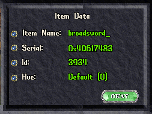

# Expressions Overview

When using the `if` or `while` conditions, you can access the following expressions to check against.

The following operators are supported:

| Operator | Description           |
| -------- | --------------------- |
| =        | Equal                 |
| ==       | Equal                 |
| !=       | Not equal             |
| <        | Less than             |
| <=       | Less than or equal    |
| >        | Greater than          |
| >=       | Greater than or equal |

## count/counter

- `count ('name of counter')`
- `counter ('name of counter')`
- `count ('name of item') [hue]`
- `count (graphicID) [hue]`

Description: Used to get the current amount of a specific item in player's backpack.
Omitting the hue argument will result in count of all items of the specified type regardless of their hue.
The expression can be used either directly by item type and hue, or by referencing a named counter manually set up in the Counters tab.
[More info](../help/displaycounters.md#counters)

!!! example

    === "Counting garlic"

        ```vim
        if count 'garlic' < 5
            say 'getting low on garlic'
        endif
        ```
        
    === "Counting runebooks"
    
        ```vim
        if count 'spellbook' '1121' == 0
            say 'no runebooks found!'
        endif
        ```
        
    === "Detecting fancy coins"

        ```vim
        if count 'gold coin' > count 'gold coin' 0
            overhead 'woot woot fancy coins in the pack!'
        endif
        ```

## diffhits

- `diffhits`
- `diffhp`

Description: Used to get the difference between you max hits and current hits.

!!! example

    === "General"

        ```vim
        if diffhits > 40
            overhead 'I need a heal!'
        endif
        ```

## diffmana

- `diffmana`

Description: Used to get the difference between you max mana and current mana.

!!! example

    === "General"

        ```vim
        if diffmana > 40
            skill 'Meditation'
        endif
        ```

## diffstam

- `diffstam`

Description: Used to get the difference between you max stamina and current stamina.

!!! example

    === "General"

        ```vim
         if diffstam > 30
            overhead 'Need stamina'
        endif
        ```

## diffweight

- `diffweight`

Description: Used to get the difference between you max weight and current weight.

!!! example

    === "General"

        ```vim
        if diffweight > 20
            overhead 'I can lift 20 more stone'
        endif
        ```

## followers

Description: Used to get the current number of followers.

!!! example

    === "General"

        ```vim
        if followers = 0
            overhead 'No one following me!'
        else
            overhead 'I have followers'
        endif
        ```

    === "..used with maxfollowers"

        ```vim
        if followers < maxfollowers
            overhead 'You can have more followers!'
        else
            overhead 'You hit your followers limit'
        endif
        ```

## findbuff

- `findbuff 'name of buff/debuff`

Description: Used to check if a specific buff/debuff is applied to you.

!!! example

    === "Check for magic reflection"

        ```vim
        if findbuff 'magic reflection'
            overhead 'Im set!'
        else
            cast 'magic reflection'
            wft
            target 'self'
        endif
        ```

## findtype

- `findtype ('name of item') [inrangecheck (true/false)/backpack] [hue]` OR `findtype (graphicID) [inrangecheck (true/false)/backpack] [hue]`

Description: Used to check if a specific item name of graphic ID exists. Range check, if true, will check within 2 tiles.

!!! tip "The `as` keyword"
    If you use `findtype` along with `as` you can assign a temporary variable to use throughout the script. See example below.

!!! tip "In-Game Info Gump"
    Not sure what name to enter or graphic ID to enter? Type `>info` and click on any item or mobile for more information.

    

    Click the blue dot next to the value you want to copy to the clipboard.

!!! example

    === "Find a saw"

        ```vim
        if findtype 'saw'
            say 'found saw'
        endif
        ```
    
    === "Find a saw using graphic id"

        ```vim
        if findtype '4148'
            say 'found saw'
        endif
        ```

    === "Find a saw within 2 tiles"

        ```vim
        if findtype 'saw' true
            say 'found saw within 2 tiles'
        endif
        ```

    === "Find a saw in your backpack"

        ```vim
        if findtype 'saw' backpack
            say 'found saw in my pack'
        endif
        ```

    === "Find a dagger and use it (using as)"

        ```vim hl_lines="1"
        if findtype 'dagger' as 'mydagger'
            overhead 'found dagger'
            dclick 'mydagger'
        endif
        ```

    === "Find a dagger in backpack with a hue"

        ```vim
        if findtype 'dagger' backpack 45 as 'mydagger'
            overhead 'found dagger'
            dclick 'mydagger'
        endif
        ```

## hidden

- `hidden`

Description: Used to check if you are hidden.

!!! example

    === "Check if hidden"

        ```vim
        if hidden
            overhead 'they cant see me'
        endif
        ```

## hp & maxhp

- `hp`
- `maxhp`
- `hits`
- `maxhits`

Description: Used to get your current or max hit points/health levels.

!!! example

    === "Example 1"

        ```vim
        while hp < 100
            say 'not at 100 yet'
            wait 5000
        endwhile
        ```

    === "Example 2"

        ```vim
        if maxhp = 120
            say 'Full hp!'
        endif
        ```

## insysmsg

- `insysmsg ('message to look for')`
- `insysmessage ('message to look for')`

Description: Used to check if certain text appears within the system message log.

!!! tip "System Message Queue"
    Not sure if a specific message is in Razor's system message queue? Type `>sysmsgs` to see what Razor can find.

    Using `clearsysmsg` will clear out the queue completely.

!!! example

    === "Check for message"

        ```vim
        if insysmsg 'too far away'
            overhead 'You are too far away'
        endif
        ```   

## lhandempty

- `lhandempty`

Description: Used to check if your left hand is empty

!!! example

    === "General"

        ```vim
        if lhandempty
            hotkey 'empty right hand!'
        endif
        ```

## mana & maxmana

- `mana`
- `maxmana`

Description: Used to get your current or max mana levels.

!!! example

    === "General"

        ```vim
        while mana < maxmana
            skill 'meditation'
            wait 11000
        endwhile
        ```

## maxfollowers

Description: Used to get the maximum number of allowed followers.

!!! example

    === "General"

        ```vim
        if followers = maxfollowers
            overhead 'You hit your limit'       
        endif
        ```

    === "..used with followers"

        ```vim
        if followers < maxfollowers
            overhead 'You can have more followers!'
        else
            overhead 'You hit your followers limit'
        endif
        ```

## maxweight

- `maxweight`

Description: Used to get your max allowed weight.

!!! example

    === "General"

        ```vim
        if weight <= maxweight
            say 'I am overweight'
        endif
        ```


## mounted

- `mounted`

Description: Used to check if you are currently on a mount

!!! example

    === "General"

        ```vim
        if mounted
            say 'mounted'
        else
            say 'not mounted'
        endif
        ```

## poisoned

- `poisoned`

Description: Used to check if you are currently poisoned.

!!! example

    === "General"

        ```vim
        if poisoned
            hotkey 'drink cure'
        endif
        ```

## position

- `position (x, y)`
- `position (x, y, z)`

Description: Used to check if your current position matches the provided.

!!! example

    === "General"

        ```vim
        if position 2729 2133
            overhead 'You are currently in front of the Bucs Den teleporter'
        elseif position 2728 2133 5
            overhead 'You are standing on the Bucs Den teleporter'
        endif
        ```

## queued

- `queued`

Description: Used to check if your current queue is active (from restocking, organizing, etc)

!!! example

    === "General"

        ```vim
            if queued
                overhead 'Queue is active'
            else
                overhead 'No queue'
            endif
        ```

    === "Organizer"

        ```vim
        overhead 'Organizing'

        organizer 1

        while queued
            overhead 'Currently Organizing'
            wait 500 
        endwhile

        overhead 'Organized'
        ```

    === "Restock"

        ```vim
        overhead 'Restocking'

        restock 11
        waitfortarget 
        target 'self'

        while queued
            overhead 'Currently restocking'
            wait 500 
        endwhile

        overhead 'Restocked'
        ```

## rhandempty

- `rhandempty`

Description: Used to check if your right hand is empty

!!! example

    === "General"

        ```vim
        if rhandempty
            hotkey 'empty right hand!'
        endif
        ```

## skill

- `skill ('name')`

Description: Used to get the current skill level for a given skill.

!!! tip "Supported skill names"
    `anatomy, animallore, itemidentification, itemid, armslore, begging, peacemaking, peace, cartography, detectinghidden, discord, discordance, evaluatingintelligence, evalint, forensicevaluation, forensiceval, hiding, provocation, provo, inscription, poisoning, spiritspeak, stealing, taming, tasteidentification, tasteid, tracking, meditation, stealth, removetrap, imbuing`

!!! example

    === "General"

        ```vim
        if skill 'magery' < 62.5
            cast 'invisibility'
            waitfortarget
            target 'self'
        endif
        ```

## stam & maxstam

- `stam`
- `maxstam`

Description: Used to get your current stamina or max stamina.

!!! example

    === "General (stam)"

        ```vim
        if stam < 30
        say 'I need to rest'
        endif
        ```

    === "General (maxstam)"       

        ```vim
        if maxstam = 120
        say 'I feel so powerful!'
        endif
        ```

## str, dex & int

- `str`
- `dex`
- `int`

Description: Used to get your current strength, dexterity and intelligence.

!!! example

    === "General"

        ```vim
        if str = 100
            say 'I am a strong person'
        endif
        ```

## targetexists

- `targetexists ['any'/'beneficial'/'harmful'/'neutral']`

Description: Used to check if the client current has a target cursor up

!!! example

    === "General"

        ```vim
        if targetexists 'beneficial'
            overhead 'Beneficial target found'
        elseif targetexists 'harmful'
            overhead 'Harmful target found'
        endif
        ```

## varexist

- `varexist`
- `varexists`

Description: Used to check if a variable exists.

!!! example

    === "General"

        ```vim
        if not varexist 'myrunebook'
            overhead 'Runebook variable not found -- select one'
            setvar 'myrunebook'
        endif

        dclick 'myrunebook'
        waitforgump 'any'
        gumpresponse 5
        ```

## weight

- `weight`

Description: Used to get your current weight.

!!! example

    === "General"

        ```vim
        if weight = 300
            say 'I feel heavy'
        endif
        ```
