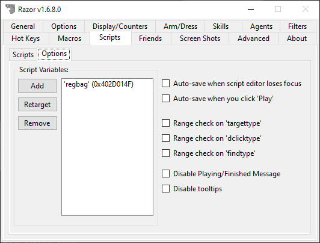

# Variables Overview

Variables (also referred to as aliases) are commonly used values designed to be referenced in any of your scripts.

You can either define your own variables or you can use this list of pre-defined variables.

# Defining Variables

You can create custom variables that are available in your scripts.  This can be done one of two ways.  First, you can create custom variables in the Razor UI by going to the Options tab under the Scripts tab.



Simply click Add, give it a name and target the item or mobile and that variable is available in your scripts.  In the screenshot above, `regbag` is set to a bag.  To use this variable in a script, you simply reference it.

* Open your reg bag

```razor
dclick 'regbag'
```

You can also set variables in scripts by using the `setvar` command.  To update the `regbag` command, you might do something like this:

* Get target cursor to select item or mobile

```razor
setvar 'regbag'
```

The script will pause until you select a target. After you select a target, it will update and move on to the next line in the script.

# Pre-Defined Variables

Along with defining your own variables, you can use these pre-defined variables in your scripts.

| Variable          | Description                                                |
| ----------------- | ---------------------------------------------------------- |
| `backpack`          | `Returns:` The serial of your own backpack                 |
| `hands`             | `Returns:` The serial of the item in either hand           |
| `index`             | `Returns:` The index of the current loop iteration           |
| `lasttarget` / `last` | `Returns:` The serial of your current last target in Razor |
| `lastobject`        | `Returns:` The serial of your last used object in Razor    |
| `lefthand`          | `Returns:` The serial of the item in your left hand        |
| `righthand`         | `Returns:` The serial of the item in your right hand       |
| `self`              | `Returns:` The serial of your player                       |

## Index Variable

When using `for` or `while` you have access to the `index` variable. This can be used with `overhead` (for example) to indicate the current loop number.

For example, this script snippet will output the numbers 0-9 overhead every second.

```razor
for 10
    wait 1000
    overhead 'index'
endfor
```

```razor
for 10
    if index == 7
        overhead '7th loop'
    endif
endfor
```
