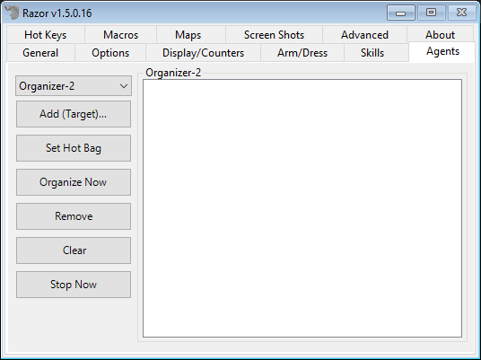
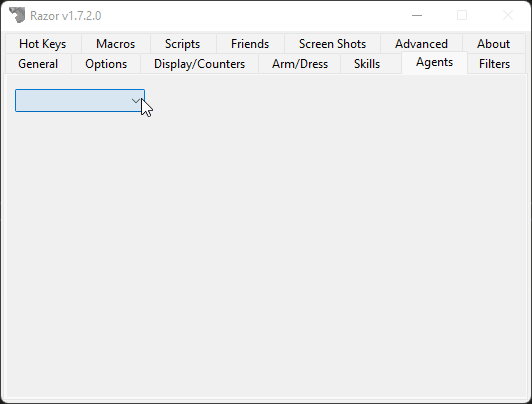

# Agents

The Agents tab is for organizing, restocking and moving items.

!!! tip "Aliases"

    You can right-click on an agent and assign it an aliases to help identify it easier.

    

## Use Once Agent

This agent lets you set item(s) in your backpack to be used via a hotkey.

Once the item is used, it is removed from the list. This is very useful for for trapped pouches. Add all your trapped pouches to the list and use them on the run. The list will remove each one as it's popped, and warn you when your list is empty.

* **Add (Target)**
    - Use this option to add items, one at a time.
* **Add Container (Target)**
    - Use this option to add the contents of an entire bag. Open the bag before targeting so Razor can 'see' the contents. This is the best option for adding multiple trapped pouches with the **Use Once Agent**. Keep them inside another bag and add the bag.
* **Remove (Target)**
    - Remove items from the list. This option gives a cursor target. Target the item to be removed.
* **Clear List**
    - Clears all items from the list.

## Sell Agent

Items on this list sell automatically to vendors when you begin a sale transaction (you must still be at the appropiate vendor). Choose how many to sell each time; a great tool for BOD collection.

The listing is done by item type, not item ID. If you have a magic longsword and a player-made longsword in your pack, adding longsword would result in both being sold. If you add plate armor to the list, the agent will attempt to sell all plate armor, colored or not, magic or not. The list can be disable without being cleared.

* **Add (Target)**
    - Click for a targeting cursor, target the item to add.
* **Remove**
    - Highlight an item in the list and click remove to delete it.
* **Set Hot Bag**
    - Razor will attempt to sell all items in a specified bag.
* **Clear**
    - Clear the list
* **Max Sell**
    - Select how many of each item to sell. Each item must be sold to the appropriate vendor. The vendor must have sufficient gold to buy the item. When you are selling you may note a discrepancy between the razor messages, gold received and the vendor replies. Razor will try to sell all items that can be sold to the vendor you are at, and the total it gives is for all those items combined. If the vendor cannot purchase all the items, the amount actually received will be less the the total stated by Razor. This does not mean you have been ripped off, only that the vendor couldn't buy everything. Continue on to the next vendor of the same type to continue selling.
* **(Push to Disable/Enable)**
    - Turn the sell agent on or off.

## Organizer Agent

This agent is used to move items from one container to another.

For example, if I purchase 20 mortar and pestle for my alchemist, I can easily bag them all without having to click and drag each one individually. If I click 20 potions from kegs and want them in my pvp supply bag, it can be done quickly without accidentally using one, without all the click and drag. There are 10 different organizers so there is room to set and keep frequently used lists. Hot keys will allow you to use the organizer and reset the target bag organized to.

* **Add (Target)**
    - Use this option to add items.
* **Set Hot Bag**
    - Set the hot bag to organize the items to. When it is already set, the tab changes to say 'Clear Hot Bag'. Both give a targeting cursor.
* **Organize Now**
    - Once everything is set, click this tab to activate the organizer.
* **Remove**
    - Highlight an item and click this tab to remove the item from the list.
* **Clear**
    - Clear the organizer; it can now be reset.
* **Stop Now**
    - Stops the organizer mid-process.

## Scavenger Agent

This agent is for automatically picking up items off the ground that are in range. Very useful, for example, during an IDOC.

* **Add (Target)**
    - Click for a targeting cursor, target the item to add.
* **Remove**
    - Highlight an item in the list and click remove to delete it.
* **Set Hot Bag**
    - Razor will put all items scavenged into this bag. If not bag is set, it will go into your main backpack.
* **Clear**
    - Clear the list.
* **Clear Scavenger Cache**
    - Razor will only try to pick up an item once, and move on. If Razor missed some items on the ground, click this button so it will try again.
* **(Push to Disable/Enable)**
    - Turn the scavenger agent on or off.

## Buy Agent

The buy agent is for setting lists of items to buy at vendors.

Used for purchasing large quantities or multiple items. Remember to check vendor prices each time Before enabling and using this agent. Use with caution, it is possible for the vendors to have items listed incorrectly. This will cause an erroneous purchase for you.

* **Add (Target)**
    - Target the item to be added to the list. A second gump (see below) prompts you to enter the amount to be purchased.
* **Edit**
    - Highlight any item in the list and click Edit to change the amount to purchase. A gump prompts you to enter the amount.
* **Remove**
    - Highlight any item and click Remove to delete it from the list.
* **Clear List**
    - Clear the entire list.
* **(Push to Disable/Enable)**
    - Use this tab to turn the agent off and on. Each buy agent can be set separately.

## Restock Agent

The Restock agent is used to drag items from a container to be placed inside your backpack.

Setting this up will enable you to restock your character at the click of a key. The restock agent will only stock up to the amount you indicate, not simply add the amounts to what you already have. For example, my restock agent is set to include 33 black pearl.

When I use the restock agent, it will top my black pearl up to 33; it won't add 33 more.

* **Add (Target)**
    - Target the item to be added to the list. A second gump (see below) prompts you to enter the amount to be purchased.
* **Remove**
    - Highlight any item and click Remove to delete it from the list.
* **Set Amount**
    - Highlight any item in the list and click Set Amount to change the restock amount. A gump prompts you to enter the amount:
* **Clear List**
    - Clear the entire list.
* **Clear Hot Bag**
    - Use this tab to set the hotbag to restock too. If no bag is indicated, Razor restocks to your main backpack.
* **Restock Now**
    - Activate the agent. You will receive a targeting cursor. Target the container to restock from. If you are at the bank, with your bank open, you can target your character to refill from the bank. This may also be set as a hotkey.

## IgnoreList Agent

Players added to this list will have all the say, yell, emote, etc blocked. Spell power words will still be seen.

* **Add (Target)**
    - Target the character to be added to the list.
* **Remove**
    - Highlight any name and click Remove to delete it from the list.
* **Remove (Target)**
    - Gives a targeting cursor. Target the player to remove from the list.
* **Clear List**
    - Clear the entire list.
* **(Push to Disable/Enable)**
    - Turn the Ignore list off and on.