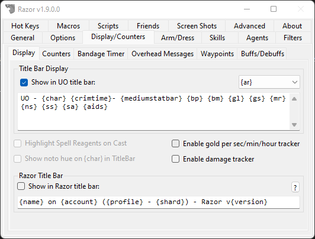
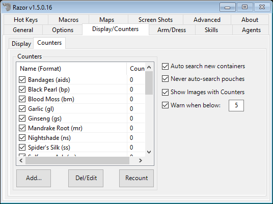
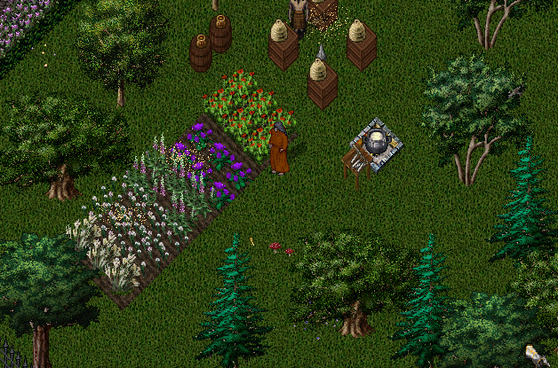
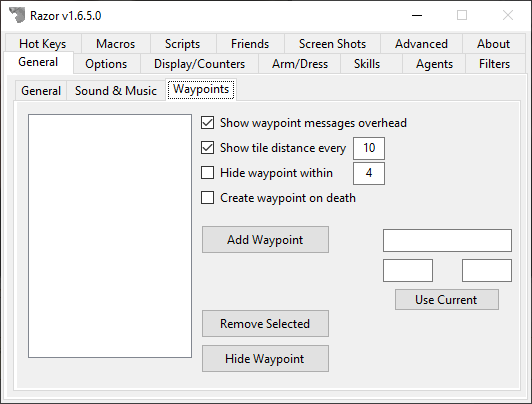

# Display/Counters

## Display

### Title Bar Display

!!! note
    If you are using ClassicUO, images will not display in the title bar. It's recommended to use the built-in counter bar.

This feature will display the values of your counters and other information in the title bar of the Ultima Online client. Along with the **Format** of the counter wrapped in `{}`, Razor has the following values built in. Check **Show in UO title bar** to enable.

- `{ar}` - Total Armor Rating
- `{char}` - This will display your character's name
- `{crimtime}` - When you become a criminal, this timer will count up until you are not longer one
- `{buffsdebuffs}` - The buffs/debuffs currently applied to your character
- `{damage}` - Display your min and max damage
- `{dex}` - Your current dex
- `{followersmax}` - The max number of followers allowed by your character
- `{followers}` - The current number of followers assigned to your character
- `{gold}` - Total amount of gold in your backpack
- `{gate}` - When you cast Gate, a timer will display for the 30 seconds the gate is up
- `{hpmax}` - Your max hit points
- `{hp}` - Your current hit points
- `{int}` - Your current intelligence level
- `{largestatbar}` - Display a large status bar
- `{manamax}` - Your max mana points
- `{mana}` - Your current mana level
- `{maxweight}` - The max number of stones you can carry
- `{mediumstatbar}` - Display a medium status bar
- `{shard}` - The name of the Shard you're playing on
- `{skill}` - When you use a skill from an assigned Razor hotkey, it will start a counter
- `{stammax}` - Your max stamina
- `{stam}` - Your current stamina
- `{statbar}` - Display a small status bar
- `{stealthsteps}` - The current number of steps taken since you stealthed
- `{str}` - Your current strength
- `{uptime}` - The length of time you've been connected
- `{weight}` - Your current weight in stones

Values that work on AOS+ servers.

- `{coldresist}`
- `{energyresist}`
- `{fireresist}`
- `{luck}`
- `{physresist}`
- `{poisonresist}`
- `{tithe}`

Here is a default title bar to built yours off of:

`{char} - {crimtime} {weight}/{maxweight} - ~#FF0000 {hp}/{hpmax} ~#~ - ~#FE2EF7 {stam}/{stammax}~#~ - ~#0080FF {mana}/{manamax} ~#~ {bp} {bm} {gl} {gs} {mr} {ns} {ss} {sa} Gold: {gold}`

#### Color

You can color the title bar text using any HTML style 6 digit hex number.  Use the code in the following manner:

HTML hex color code: `~#rrggbb` ('`~#~`' to terminate)

For the purpose of example, I want to change the color of my hp display to orange. I would use the following code to do so: `~#FF6600 {hp}/{hpmax} ~#~`. The '`~#FF6600`' tells Razor to color everything between it and the '`~#~`' to an orange color, the color orange selected by the six digits, FF6600. The '`~#~`' tells Razor to stop coloring. If you need to know the color codes for this function, try this page.

### Track gold per sec/min/hour

When using **Track Gold Per sec/min/hour** these values will work:

- `{goldtotal}` - The amount of gold collected since you checked the **Track gold per sec/min/hour** box
- `{goldtotalmin}` - The amount of time that has gone by since you started tracking your gold intake
- `{gpm}` - Display your gold per minute
- `{gps}` - Display your gold per second
- `{gph}` - Display your gold per hour

### Other

* **Highlight Spell Reagents on Cast**
    - Whenever you cast a spell, a red background will highlight the reagents used to cast the spell.
* **Show noto hue on {char} in TitleBar**
    - When enabled, the name of your character on the Title bar will show in the same color as it will when you are clicked in the game.
* **Enable gold per sec/min/hour trackers**
    - When checked, the counter will start monitoring your gold intake using the values above.

## Counters

Counters are used to track the number of items you currently have in your backpack. The most commonly used counter is for reagents but this feature can be used on any item. Razor will come with some common counters available to you by default.

#### Adding a counter

  - Click **Add...** under the list of counters.
  - Click **Target** and target the item to add. The Item ID and color fields should auto-populate for you.
  - The **Name** (of the item) is the name as you see it when you click the item.
  - The **Format** is the letter code you want to use. For example, the default for black pearl is `bp`.
  - Click **OK** once all fields are entered.
  - If you want this counter to display in the titlebar, check **Display image in title bar**. For example when used with black pearl, the title bar displays a small black pearl beside the count rather than the abbrev `bp`.

To **Edit or Remove** a counter, select it and click **Del/Edit**.

Click **Recount** to force Razor to check all the containers on your character and get the correct acounts.

### Others
* **Show Images with Counters**
    - Check this to show counter images instead of abbreviations. Each counter can be modified individually from the counter table with the edit tab to disable this.
* **Warn when a counter is below X**
    - When your counter for any specific item drops below **X**, Razor will provide a warning in red.

## Bandage Timer

* **Show bandage timer**
    - When you have this enabled, when you use a bandage a timer will display.

## Overhead Messages

Check `Enabled` to turn on the overhead messages feature.

This option will display messages above your head that are triggered based on system messages in the lower-left that come in from the server. For example, when the message `You begin applying bandages.` comes through, you can have the message `[Applying bandages]` appear above your head.

!!! tip "Expand Overhead Messages"
    You can extract specific words from the system message to display in the overhead messages (`{1}` for the first word, `{2}` for the second word, etc).
    If the system message is `You must wait 80 seconds!`, you can set the overhead message to `Wait {4}s` and it would display `Wait 80s` overhead.

| Option | Description |
| ------ | ----------- |
| Format | Set the format of the overhead message. It must contain `{msg}` for your custom message to appear. Default is `[{msg}]`.|
| Message Style | Set the message style to appear overhead depending on your preference. Default is `Unicode`. |

### Create Overhead Message

* Enter part of the message or the whole message into the `Search Text` field.
* (Optional) If you need help finding the message, click `Search` and select the message you want to capture.

!!! tip
    If your message is custom to your shard and not on the search list, simply click `Add` to capture it. It doesn't need to be a static message in the client files.

* Click `Add` and enter the message you want to appear overhead and click `OK`.
* Your overhead message capture will appear at the bottom of the list.

### Demo

## Waypoints

This feature lets you set waypoints, that will display within the client.

* **Show waypoint messages overhead**
    - Direct waypoint messages from system message to overhead.
* **Show tile distance every X**
    - If checked, it will show the current distance every X seconds.
* **Hide waypoint within**
    - When you're within X tiles, hide/clear the waypoint.
* **Create waypoint on death**
    - Upon death, create a waypoint.

### Create Waypoint

* Enter the name for the waypoint in the `Name` field.
* Either manually enter the X and Y coordinates or click `Use Current Position` to auto-fill.
* Click `Add Waypoint`

!!! tip
    Double-click a waypoint in the UI to activate it in game. You can also assign hotkeys to cycle between waypoints.