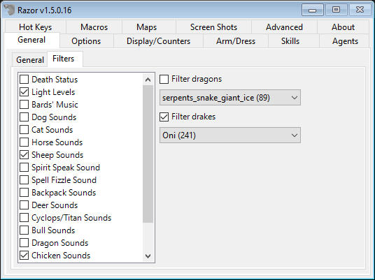
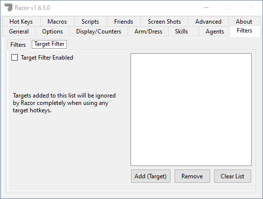
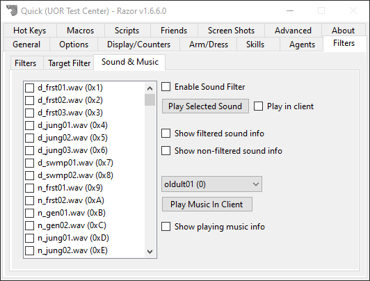

# Filters

## Filters

Filters will change the way the client will display visuals or play audio.

* **Sound Filters**
    * Allow you to block the client from playing certain sounds.
* **Light Filter**
    * Force the client to always display 100% light levels
* **Death Filter**
    * Prevent the "You are dead" animation from playing
* **Filter dragons**
    * Override the dragon graphic and replace it with something else.
* **Filter drakes**
    * Override the drake graphic and replace it with something else.
* **Filter daemons**
    * Override the daemon graphic and replace it with something else.

* **Message Filters**

Instead of spamming your screen system or overhead messages, if checked it will keep filtering messages as long as you have the filter delay. When those seconds pass, it will show you the message.

* Filter snooping messages
* Filter repeating system messages
* Filter repeating Razor messages
* Filter repeating overhead messages
* Filter Delay

## Target Filter

Mobiles on this list will be ignored completely by Razor.

!!! tip
    This feature is intended to be used to add NPCs that might be picked up during events that take place in towns or where NPCs are.

## Sound & Music

* Enable Sound Filter
    - When checked, sounds that are checked will be blocked from playing in the client.
* Play Selected Sound
    - Listen to the selected sound. If you check `Play in client` the sound will play in the client if logged in.
* Show filtered sound info
    - If a sound is blocked, show the name in system messages.
* Show non-filtered sound info
    - If a sound plays, show the name in system messages.
* Play Music In Client
    - Plays the specific song in the client if logged in.