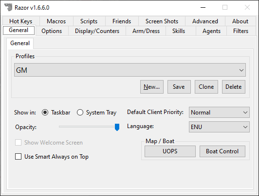

# General Settings

The General tab has setting largely related to the client itself and Razor in general.

## General

### Profiles

Each character has a profile that contains your settings, such as the options in Razor and your hotkeys.

!!! tip "Profile Location"
        Profiles are stored in the same location as `Razor.exe` under `.\Profiles\`. You can create a new profile, which will be based on the *default profile settings* (`default.xml`)

|Feature|Description|
|----|----|
|New|Create a new profile based off of the default Razor profile.|
|Save|Save all the current Razor settings without having to log out.|
|Clone|Clone the existing selected profile and create a new one.|
|Delete|Delete the selected profile.|

#### Creating a new profile

Clicking **New** will generate a new profile based on the default profile that comes with Razor. If you rather create a new profile using an existing profile, select that profile first and click the **Clone** button.

#### Saving your profiles

Razor will save your profile two ways.

* When you open your paperdoll in UO, click **Logout** and click **OK**.
    * This triggers the client to tell Razor that you logged off, which performs the profile save.
* Click the **Save** button manually to ensure your changes are saved.

### Maps / Boat

#### UOPS

Razor's Ultima Online Position System (UOPS) gives you a basic map.

#### Boat Control

**Boat Control** was inspired by UO Rudder and designed to make navigating the seas of Britannia much easier. This tool is built into Razor.

!!! tip
    Right-clicking on 1 of the 4 directions will set relative location.

### Other

|Feature|Description|
|-|-|
|Show Welcome Screen (Global Setting)|When checked, opening Razor will give you the **Welcome Screen**. This is where you can enter new servers, change your client location, etc.|
|Use Smart Always on Top|Razor will stay on top of the UO window when it becomes active and hide when it becomes inactive.|
|Show in Taskbar or System Tray|You can have Razor in the Taskbar or the System Tray. It's all up to you.|
|Default Client Priority| This changes the priority given to the process. Honestly, leave it at **Normal**. This feature should be removed. It's old.|
|Opacity|Adjust the transparency of Razor. Useful on a single monitor.|
|Language|The `.\Language\` folder contains all the translations. Some are missing, feel free to translate based on the `.enu` file located in the package.|
