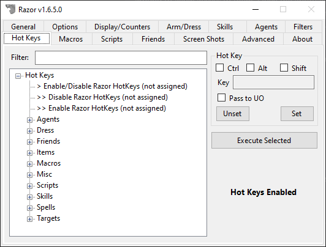

# Hot Keys

Hot keys tie your keyboard and mouse to specific actions within Ultima Online, or to specific functions within Razor.

## Filter Box

As you type in this box, the list will be narrowed down helping you find a specific hotkey.

## Hot Key Setup

- **Ctrl - Alt - Shift - Key**
    - Located on the right, these are used to select the key. Once you have highlighted the hotkey to be set from the left index, click in the key field and type the key to be used for that setting. If you want to use a key with control, shift or alt keys, check them as well.
- **Unset/Set**
    - Once you select the key, click Set. If this key combination has already been used by another setting in Razor, a warning is given. If the set is successful, the hotkey will appear beside the entry in the index. Click Unset to remove the key combination.
- **Command**
    - You can define a custom command (accessed via `>command`) here that will execute this hotkey wouldn't hitting the key combination.
- **Pass to UO**
    - When you set a hotkey, it becomes a key combination for Razor. Check this box to have hotkeys continue on to the client. If you do not check this box, Razor will read the command and it will go no further.
- **Execute Selected**
    - Useful for using commands from the hotkey list without setting a key. For rarely used actions or testing.

## Hot Key Categories

Hot keys are broken up into several categories.

- **Agents**
    - Hot keys related to using your agents
- **Dress**
    - Hot keys related to arming/disarming yourself and executing one of the **Arm/Dress** selections.
- **Friends**
    - Hot keys related to adding friends, enabling and disabling friend groups.
- **Items**
    - Hot keys related to using bandages, potions and items in your hand.
- **Macros**
    - Hot keys that will run **Macros** you've created.
- **Misc**
    - Hot keys that don't fall under any specific category. Notable section is **Special Moves** for Stun or Disarm.
- **Scripts**
    - Hot keys related to running scripts.
- **Skills**
    - Hot keys related to executing your skills.
- **Spells**
    - Hot keys related to casting your spells.
- **Targets**
    - Hot keys related to selecting targets.

## Notoriety & Target Definitions

| Type       | Notoriety Color         |
| ---------- | ----------------------- |
| Innocent   | Blue                    |
| Guild/Ally | Green                   |
| Attackable | Gray (but not criminal) |
| Criminal   | Gray                    |
| Enemy      | Orange                  |
| Murderer   | Red                     |

| Target       | Type                                  |
| ------------ | ------------------------------------- |
| Non-Friendly | Attackable, Criminal, Enemy, Murderer |
| Friendly     | Innocent, Guild/Ally                  |
| Enemy        | Enemy                                 |
| Red          | Murderer                              |
| Grey         | Attackable, Criminal                  |
| Criminal     | Criminal                              |
| Innocent     | Innocent                              |
