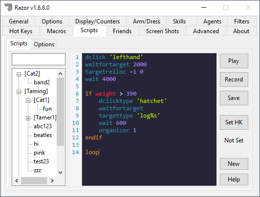

# Scripts

The Razor Scripting Engine is a "command based scripting language" designed to make it easier to read, create, edit and share Razor scripts.

For a comprehensive guide on how to use it, please go [here](https://www.razorce.com/guide/).

