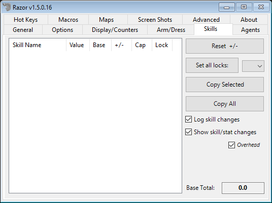

# Skills

The Skills tab gives you general information about your skills.

## Skill Table

* **Skill Name**
    - This will list every skill in the game.
* **Value**
    - This is your skill level before stat modifiers are applied.
* **Base**
    - Your skill level with stat modifiers applied. Also known as the **'Show Real'** skill level. Use these numbers when calculating skill caps.
* **+/-**
    - This column shows any change in skill level since you logged in, or used the reset button.
* **Cap**
    - The skill cap for each skill.
* **Lock**
    - The lock setting for each skill. `'D'` for down, `'U'` for up, and `'L'` for a locked skill.

## Other

* **Reset +/-**
    - Resets all +/- column entries in the skill table to 0.0
* **Set all locks**
    - Set the locks for all skills according to your selection from the drop-down tab.
* **Copy Selected**
    - Copies the skill information from the selected skills to the clipboard. Click a skill to highlight it. For multiple skill selection, hold the control key and click all skills to be copied.
* **Copy All**
    - As above, all skills are automatically selected with this tab.
* **Log skill changes**
    - All your skill changes will be logged and timestamp into a `.csv` file in your Razor folder.
* **Show skill/stat changes**
    - When checked, Razor will inform you of each skill level change, the change amount and the total change since the last +/- reset.
* **Capture MIBs to file**
    - When you open an MIB, a file is written to the root folder of Razor.

!!! warning
    This feature only works with the default RunUO MIB Gump.

* **Base Total**
    - Displays your character's total base skill level.