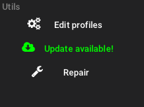
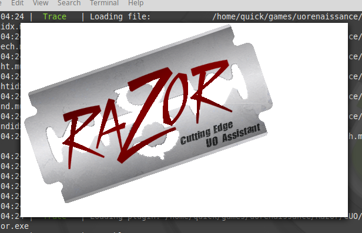

# Overview

To run Razor with [ClassicUO](https://www.classicuo.eu/) on Linux, you will need to install [Mono](https://www.mono-project.com/)

!!! info
    These steps are based on a fresh installation of Linux Mint 19.1 which is based on Ubuntu. Based on your current configuration and Linux distribution, the steps may vary.

## Install Mono

!!! warning
    If you're running another version of Linux, please find the the installation steps from the main Mono site and follow those instead.

* Open the command/console/terminal and add the Mono repo to your system

```bash
sudo apt install gnupg ca-certificates
sudo apt-key adv --keyserver hkp://keyserver.ubuntu.com:80 --recv-keys 3FA7E0328081BFF6A14DA29AA6A19B38D3D831EF
echo "deb https://download.mono-project.com/repo/ubuntu stable-bionic main" | sudo tee /etc/apt/sources.list.d/mono-official-stable.list
sudo apt update
```

* Install the latest version of Mono

```bash
sudo apt install -y mono-complete
```

* Run the following commands from the console:

```
sudo apt-get install -y libmono-system-windows-forms4.0-cil
sudo apt-get install -y libmono-system-net-http4.0-cil
sudo apt-get install -y libmono-system-runtime-serialization4.0-cil
```

## Install libz

This package is required for ClassicUO to load gumps successfully.

* Install `libz`

```
sudo apt-get install -y libz-dev
```

## Install ClassicUO

* Download the latest version of the [ClassicUO Launcher](https://www.classicuo.eu/).
  
* Extract `ClassicUOLauncher-linux-x64-release.zip` to a local folder (ie: `/home/username/games/classicuo-launcher`)

```bash
mkdir /home/username/games/classicuo-launcher
cd /home/username/games/classicuo-launcher
unzip ClassicUOLauncher-linux-x64-release.zip.zip
```

* Run ClassicUO Launcher

```bash
chmod +x ClassicUOLauncher

./ClassicUOLauncher
```

* Install ClassicUO by clicking **Update Available**



## Install Razor

* Download the latest version of [Razor](../download.md).
* Extract to `/home/username/games/classicuo-launcher/ClassicUO/Data/Plugins/Razor`
* Click **Edit Profiles** and setup your profile (server name, Ultima Online path, client version, etc)
* Click **Plugins** and then **Add** and browse to `/home/username/games/classicuo-launcher/ClassicUO/Data/Plugins/Razor` and select `Razor.exe`
* Save the profile and click **Launch**

!!! tip
    You can also run ClassicUO without using the launcher.

    Go to `/home/username/games/classicuo-launcher/ClassicUO` and type `mono ClassicUO.exe` or `./ClassicUO`

!!! warning

    On first launch, it might appear stuck on the Razor splash screen.

    

    Behind that is a message box warning you that it will use a default profile. If you experience this, simply hit `Enter` with the splash screen active.
