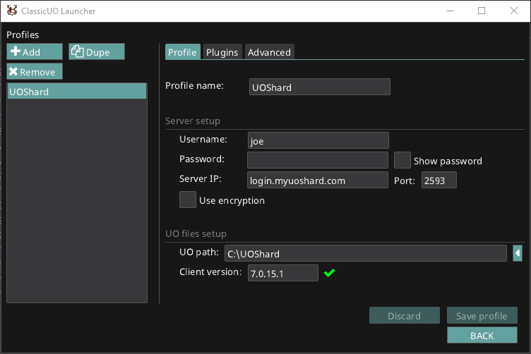
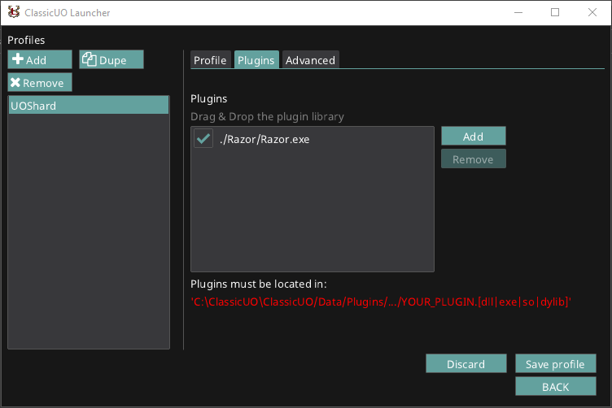

!!! warning "Client Support"
    It's **highly recommended** that you use the [ClassicUO](https://www.classicuo.eu/) client with this version of Razor, however it should work with the original 5.x and 7.x clients though support for any bugs may be limited.

# Install: Razor and ClassicUO

First, we need to download and install ClassicUO.

1. Download the [ClassicUO Launcher](https://www.classicuo.eu) and extract the `.zip` file to any location of your choosing (ie: `C:\CUOLauncher`)
2. Run `ClassicUOLauncher.exe`
3. When `ClassicUOLauncher.exe` opens, it will automatically download the latest version of ClassicUO and install it in a sub-folder called `ClassicUO` in the folder you extracted the launcher (ie: `C:\CUOLauncher\ClassicUO`). This process should only takes a few seconds.
4. Setup a profile to connect to your shard by clicking `Edit Profiles`
5. On the `Profile` tab click `Add`  
    - Give your profile a name
    - Enter your username and password if you'd like it to be saved
    - Enter the server IP and port number of the shard you're connecting to
    - Enter (or search for) the path to your UO files. These are the actual game files for the shard you're connecting to
    - Enter the client version number if it isn't auto-detected
  
Example of a completed profile:



Now, we need to install Razor.

1. [Download](../download.md) the latest version of Razor and extract the `.zip` file to `C:\CUOLauncher\ClassicUO\Data\Plugins\Razor` (replacing `C:\CUOLauncher` with the location you selected above if you picked something different)

    !!! hint
        If the `Data` and/or `Plugins` folders don't exist (most likely scenario on a new install) you can just create them first.

2. In the ClassicUO Launcher, go to the `Plugins` tab and click `Add`
3. Browse to the `\Data\Plugins\Razor` folder and select `Razor.exe`

    

4. Click `Save Profile` and then `Back`
5. Select your profile and click `Launch`

If everything was setup correctly, you should see ClassicUO along with Razor open.

## Advanced: settings.json

If you would like to configure ClassicUO and Razor without the launcher, create a file called `settings.json` and copy/paste this template into it and change the following values: `ip, port, ultimaonlinedirectory, clientversion, plugins`

```json
{
  username: "",
  password: "",
  ip: "login.myshard.com",
  port: 2593,
  ultimaonlinedirectory: "C:/Path/To/UO/Files",
  clientversion: "5.0.8.3",
  lastcharactername: "",
  cliloc: "Cliloc.enu",
  lastservernum: 1,
  fps: 60,
  window_position: null,
  window_size: null,
  is_win_maximized: true,
  saveaccount: false,
  autologin: false,
  reconnect: false,
  reconnect_time: 30,
  login_music: true,
  login_music_volume: 30,
  shard_type: 0,
  fixed_time_step: true,
  run_mouse_in_separate_thread: true,
  force_driver: 0,
  use_verdata: false,
  encryption: 0,
  plugins: [
  "C:/Path/To/Razor/Razor.exe"
  ]
}
```

# Update: Razor and ClassicUO

These steps assume that you already have obtained and installed the Ultima Online game asset files in the local system and are already using ClassicUO.

- [Download the latest release of Razor](../download.md).

    !!! warning
        Windows will sometimes block `.dll` and `.exe` files from being ran after they're downloaded so you may have to open up a Powershell prompt from within the Razor folder and run `gci | Unblock-File`

- Extract the `.zip` into your existing Razor location (ie: `C:\CUOLauncher\ClassicUO\Data\Plugins\Razor`), overwriting all files, with the exception of one file:
    - **counters.xml** - This is the default counters file used to display items in your titlebar. If you've added any new counters, they would be lost if overwritten.
- Open ClassicUO back up and verify Razor is running the version you upgraded to.  

!!! hint "Standard OSI Client"

    The upgrade steps above should also work if you're using the standard OSI client, follow these steps.

    * Right-click on the Razor shortcut or Razor.exe, go to Properties. On the Compatibility tab, select **Run this program in compatibility mode** for and select **Windows XP SP2**. Also select **Run this program as an administrator**
    * Run Razor either via the shortcut or clicking the Razor.exe directly.
    * Razor should prompt to **Run As Administrator**. You must allow this for Razor to function correctly.

# Welcome Screen (Legacy Client Only)

!!! error "ClassicUO Users"
    If you're using ClassicUO, you should *never* see this screen. If you're trying to open ClassicUO and see this screen, click **Quit** and launch ClassicUO.

If you're using the legacy client, to The first time you run Razor, it will open with a **Welcome Screen** and give you an option to import your existing settings if they exist.


Browse to your `client.exe` that you want to run along with Razor. Set the **UO Data Directory** (most likely the same path as your `client.exe`). Either use the pre-configured servers or enter your own server in the list here.

Click **OK** to open Razor and Ultima Online.
