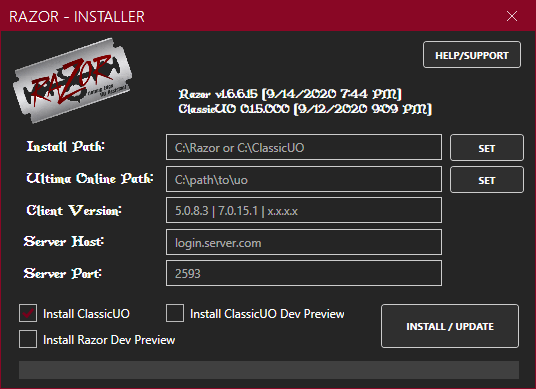

!!! warning "Client Support"
    It's recommended that you use the latest version of the [ClassicUO](https://github.com/andreakarasho/ClassicUO) client with this version of Razor, however it should work with the original 5.x and 7.x clients though support for any bugs may be limited.

    When using ClassicUO, some features in Razor are disabled since they either won't work and/or may cause conflicts with ClassicUO.

# Install: New ClassicUO with Razor Install (Installer)



This is a simple install process for Razor with the option to install ClassicUO.

* Download the [latest release](https://github.com/markdwags/razor-installer/releases)
* Extract `RazorInstaller.zip` and run `RazorInstaller.exe`
* Select an installation path (this is where Razor and/or ClassicUO will install)
* Select the path to your UO data files (this is where you installed Ultima Online)
* Enter the client version for the UO files (for example, 5.0.8.3 or 7.0.15.1)
* Enter the server host name to the shard you play on
* Enter the port (it's usually 2593)

If you want to run the dev preview of Razor or ClassicUO, check the box.

* When ready, click `Install / Update`

When complete, you will be prompted to run either Razor or ClassicUO.

# Install: New ClassicUO with Razor Install (Powershell)

This [Powershell script](https://github.com/markdwags/Razor/blob/master/InstallClassicUOAndRazor-NoDefaults.ps1) is designed to help you install ClassicUO and Razor.

* Create a new folder on your local computer (ie: C:\Games\ClassicUO)
* Open PowerShell prompt and go to folder you created
* Execute the following PowerShell commands

```powershell
Set-ExecutionPolicy Bypass -Scope Process -Force; iex ((New-Object System.Net.WebClient).DownloadString('https://raw.githubusercontent.com/markdwags/Razor/master/InstallClassicUOAndRazor-NoDefaults.ps1'))
```

!!! warning
    If you are on an older version of Windows, you may experience issues running this command.  You can get the latest version [here](https://www.microsoft.com/en-us/download/details.aspx?id=54616).

* Follow the on-screen prompts to set up the ClassicUO settings.json file first the first time.

# Install: Existing ClassicUO and/or Standard Client

These steps assume that you already have obtained and installed the Ultima Online game asset files in the local system and are already using ClassicUO or the standard client.

* Download the latest release
* Extract into any location (ie: `C:\UO\Razor`)

!!! warning
    Windows 10 will block `.dll` files downloaded, so you may have to open up a Powershell prompt from within the Razor folder and run `gci | Unblock-File`

* ***(Optional)*** If you have an existing version of Razor, copy the Profiles, Macros and Scripts folders from `%AppData%\Razor` into the folder you extracted the zip above to. If you have custom counters, also copy `counters.xml` over.

## ClassicUO Client

If using the ClassicUO client, follow these steps.

* Go to the folder where you have ClassicUO installed and edit `settings.json`.

```json
  "plugins": [
    ".\\Assistant\\Razor.dll"
  ]
```

* Find the section above and edit the path to point to where you extract Razor in the above step. For example, if I extracted it to `C:\UO\Razor` my `settings.json` would look like one of these depending on the slashes you use.

!!! tip "Slashes"
    If you use backslash (`\`) you must use double backslashes `\\`.  You can also use a single forward slashes (`/`) such as `"C:/UO/Razor/Razor.exe"`

```json
  "plugins": [
    "C:\\UO\\Razor\\Razor.exe"
  ]
```

or

```json
  "plugins": [
    "C:/UO/Razor/Razor.exe"
  ]
```

* When you launch ClassicUO, Razor will load up during the startup process.

## Standard Client

If using the standard OSI client, follow these steps.

* Right-click on the Razor shortcut or Razor.exe, go to Properties. On the Compatibility tab, select **Run this program in compatibility mode** for and select **Windows XP SP2**. Also select **Run this program as an administrator**
* Run Razor either via the shortcut or clicking the Razor.exe directly.
* Razor should prompt to **Run As Administrator**. You must allow this for Razor to function correctly.

# Upgrading

!!! tip "Razor Installer"
    Use the [Razor Installer](../install/windows/) to update Razor and ClassicUO installed with a single click.

Since Razor is portable, upgrading it is a copy/paste exercise.

* [Download the latest release of Razor](../download.md).
* Extract the zip into your existing Razor location (ie: `C:\UO\Razor`), overwritting all files, with the exception of two:
    * **counters.xml** - This is the default counters file used to display items in your titlebar. If you've added any new counters, they would be lost if overwritten.
    * **Razor.exe.Config** - This is the config file that stores your UO path, server list, etc. Copying this over will overwrite those settings.
* Open ClassicUO or Razor back up and log back in.

# Welcome Screen (OSI Client Only)

!!! error "ClassicUO Users"
    If you're using ClassicUO, you should *never* see this screen. If you're trying to open ClassicUO and see this screen, click **Quit** and launch ClassicUO.

The first time you run Razor, it will open with a **Welcome Screen** and give you an option to import your exising


Browse to your `client.exe` that you want to run along with Razor. Set the **UO Data Directory** (most likely the same path as your `client.exe`). Either use the pre-configured servers or enter your own server in the list here.

You can also edit `Razor.exe.Config` and add your own servers or just enter the server name and port in this format: `server.name.com,port`

Click **OK** to open Razor and Ultima Online.

# Configuration File

The **Welcome Screen** will control some of these settings, but some settings can only be changed by editing `.\Razor.exe.config`.

```xml
<appSettings>
    <add key="PatchEncy" value="1" /> <!-- Patch client encryption -->
    <add key="ServerEnc" value="0" /> <!-- Use OSI encryption -->
    <add key="MaxOrganizerAgents" value="20" /> <!-- Override the default Organizer agent count -->
    <add key="MaxBuyAgents" value="10" /> <!-- Override the default Buy agent count -->
    <add key="MaxRestockAgents" value="10" /> <!-- Override the default Restock agent count -->
    <add key="ImportProfilesAndMacros" value="false" />  <!-- If true, will import macros and profiles from %AppData%\Razor -->
    <add key="LastProfile" value="Test" /> <!-- Last profile used in Razor -->
    <add key="LastServer" value="test.server.com" /> <!-- Last server connected to in Razor -->
    <add key="LastPort" value="2597" /> <!-- Last server port connected to in Razor -->
    <add key="LastServerId" value="1" /> <!-- Index of the server selected in the dropdown -->
    <add key="ShowWelcome" value="1" /> <!-- Show the Welcome Screen when loading Razor -->
    <add key="UOClient" value="D:\Games\UO\client.exe" /> <!-- Location to Ultima Online client -->
    <add key="UODataDir" value="D:\Games\UO" /> <!-- Location to Ultima Online data directory -->
</appSettings>

<!-- You can define a list of servers here by adding values between <Servers></Servers> -->
<Servers>
    <add key="Custom Server" value="server.someserver.com,2593" />
</Servers>
```