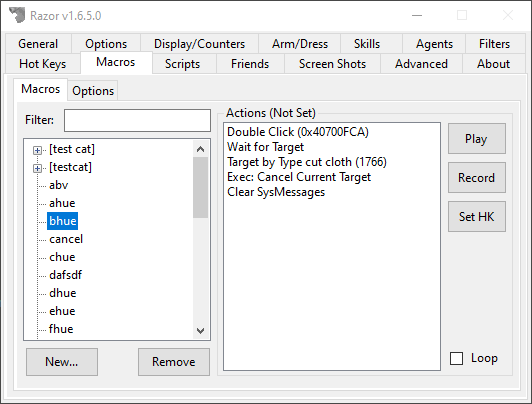
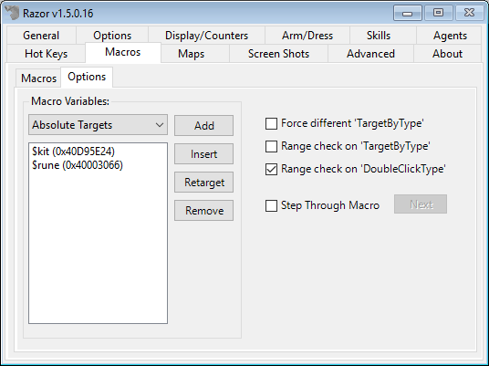

# Macros

The Macros tab is an indispensable tool. Record a set of actions often repeated. The macro can then be run repeatedly to copy the same actions. In this manner, less wear and tear is put on your mouse. Macros can be used to macro skill, even afk or while playing another character. Macros can be used for gathering resources and crafting.

Macros are divided into two sections. The column on the left is the macro index of all macros you make. On the right is the action area, used to set and edit the macros you create. Macros are saved to a folder, 'Macros', in your Razor folder. These can be edited in text format.

## Macros

### Categories

Categories can be created to organize your macros into groups. While, unlike the rest of the profile, macros are shared across all characters. Each character can have their own hot key settings depending on how frequent that character would use the macro (if at all).

**Right click the left column for the following options:**

* **Add Category**
    - Add a category to place macros in. A gump will prompt you to enter a name.
* **Delete Category**
    - Highlight a category and click delete to remove it. Macros inside the category will need to be removed first.
* **Move to Category**
    - Move macros to the category you choose.
* **Refresh Macro List**
    - Update changes made to the list.

## Creating a macro

To Create a Macro, begin by clicking the 'New' tab at the bottom of the gump. A second gump prompts you to enter the name of the macro; click 'OK'.

The macro will now appear in the left index. Highlight the macro name with a left click. A list of functions to set the macro will now show beside the right action window. Right click the macro name to move it into a category if you choose.

### Set/Recording a macro

To Set/Record a Macro, highlight the macro in the left index. Click the 'Record' tab on the right and go through the actions in-game that you want in the macro. When you have finished, click the 'Stop' tab. Once the macro is created, the 'Stop' tab will change to a 'Play' tab when the macro is not running. To clear the macro entirely for re-recording, click the Record tab again. A prompt warns your original macro will be cleared.

You now have the basis of a macro. From here, you can fine tune it with a list of options found with a right-click.

* **Reload**
    * Update Razor folder changes without closing Razor. This option will applies to the entire Razor folder, not specific macros. If you have edited a macro in text format, or added a a pre-made macro to the folder that isn't showing up, use this option.
* **Save**
    * Saves changes made to Razor in the text file without closing the program.
* **Move Up/Down**
    * Highlight a line and move it up or down with these two commands. Useful for changing text placement, misplaced commands, and more. **Tip:** If you hold down `CTRL-ALT` and use the `UP` and `DOWN` keys.
* **Remove Action**
    * Highlight a line and click this option to delete the action from the macro. This cannot be recovered except by re-recording the action.
* **Begin Recording Here**
    * Use this option to add actions you have missed. Razor will begin recording in the current macro. The action(s) will appear after the line highlighted.
* **Play from Here**
    * Play the macro from the line indicated. Useful for checking macros as you set them.
* **Special Constructs**    
    * **Pause/Wait**
        * This option gives a second gump of choices. A pause can be entered based on a specific amount of time. Waits can be added for gumps, targets, and old-style menus. Waits can also be added based on hitpoints, mana, or dexterity reaching a specified amount.
        For example: Wait for Mana <= 90
    * **Set Last Target**
        * Gives a cursor to set a new last target.
    * **Comment**
        * Does not actually appear in the macro. This is for user notes and comments.
    * **"If" Conditional**
        * Set a command depending on circumstances - If mana is <= ; If black pearl =>
    * **"Else"**
        * You can continue the "if" conditional by adding 'else'. For example: 
        * If black pearl is <= 32
        * Use restock agent 5
        * Else If black pearl is => 33
        * Use organizer agent 5
        * End if
        * This would tell razor to restock with restock agent 5 if black pearl if it is equal to or less than 32, use organizer agent 5 if black pearl is equal to or greater than 33.
    * **"End If"**
        * Use this line to end your 'if' commands. This tells Razor this part of the macro is complete.
    * **"For Loop"**
        * A command to loop (repeat) all actions following. A gump appears with this option, enter the number of times to repeat.
    * **"End For"**
        * Use this when actions to be looped have ended. This line tells razor the "for Loop" part of the macro has ended.

## Options

This version of Razor has an expanded section with additional macro options

#### Absolute Target Variables

The concept with **Absolute Target Variables** is to remove duplicate macros for the same thing. For example, you have a Recall macro that casts recall, waits for target, and clicks a rune or runebook. If you have 5 characters doing the same thing, you need 5 macros because the unique ID of the rune or runebook is different.

With **Absolute Target Variables** in that same scenario, you can have one macro cover all 5 characters. Your macro and absolute target variable might look like this:

 

As long as you have setup a `$rune` variable on your profile, that macro will work across all profiles.

* **Add**
    * This will give you a target in game to select the item to create a variable based on
* **Insert**
    * This will insert the currently selected variable into the selected macro.
* **Retarget**
    * If you need to update the variable to a new item, use this.
* **Remove**
    * Remove the selected variable from the list.

### Options

* **Force different 'TargetByType'**
    * Prevents a macro from selecting the same item over and over (for example, the item is out of range)
* **Range check on 'TargetByType'**
    * Macros will only target items by type that are in range of your character. This is to prevent a macro from trying to target an item out of range.
* **Range check on 'DoubleClickType'**
    * Same idea here. Macros will only double-click items in range of your character.
* **Step Through Macro**
    * If checked, each step in the macro will require you to click `Next`. Useful for debugging your macros.

* **Default macro action delay (50ms)**
    - The OSI client required a 50ms delay, which isn't required by ClassicUO. Some macros were designed with ths 50ms delay in mind. Checking this and restarting Razor will restore it. 
* **Disable Playing/Finished Message**
    - Hide the message that shows when you run a macro.
