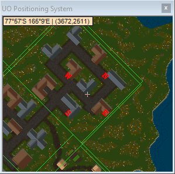

# Maps

## JMap

**JMap** is a mapping application built into Razor with the goal to replace the need for additional 3rd party applications to provide Ultima Online mapping capabilities.

## Boat Control

**Boat Control** was inspired by UO Rudder and designed to make navigating the seas of Britannia much easier. This tool is built into Razor.

Right-clicking on 1 of the 4 directions will set relative location.

## UOAM

UOAM is still an option available.  If you're having issues getting Razor and UOAM linked up, please visit the [help section](help.md#uoam-location-tracking)

## Ultima Mapper

Ultima Mapper is fully supported.  You can download it at [ultimamapper.com](http://www.ultimamapper.com)

## UOPS

Razor's Ultima Online Position System (UOPS) is still available as well. Click **Open UO Map System** to access it.

