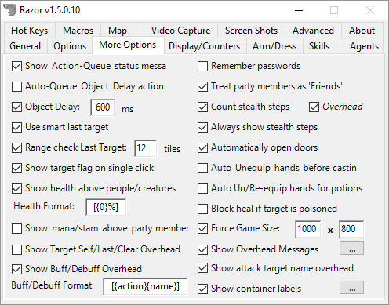

# More Options

* **Show Action-Queue status messages**
    - A toggle to turn off/on messages about actions being queued. Unchecking this option will still allow some important messages to come through.
* **Auto-Queue Object Delay actions**
    - When checked, Razor will automatically queue up your double-clicks. It will prevents the message "You must wait to perform another action". This is an important setting for a well-run macro. The object delay field below should reflect your specific connection. Set the object delay at your average ping to the server + 500 (approx)
* **Use smart last target**
    - When this box is checked, Razor will use beneficial and harmful spells according to your previous actions. For example, in battle if you cast Energy Bolt (a harmful spell) at an enemy and Greater Heal (a beneficial spell) at a friend, Razor will remember the last targets for each spell type. The next time you cast a harmful spell with last target, Razor will target the enemy even if you just casted Greater Heal on your friend with last target.
* **Range check Last Target: *X* tiles**
    - This option will have Razor check that last target is within range. If it's not, Razor sends a warning message and your target is not cancelled out. Last Target can be selected to try again without having to bring the cursor up a second time.  Select the number of tiles, within game allowances.
* **Show target flag on single click**
    - Select to display a text flag over last targets; to be used with Smart Target option. Flags show as `[Current Target]`, `[Beneficial Target]`, or `[Harmful Target]`.
* **Show health above people/creatures**
    - Check this option to show changes in player's health with a text percentage over their heads. The numbers will show in blue - green at 100%, to yellow at 50%, to purple - red at 0%.
    - **Default Health Format** - `[{0%}]` or `[NN%]`
* **Show mana/stam above party members**
    - As above, but mana and stamina. 

>> ***Note:** To edit this format, go into your profile and search for `PartyStatFmt`. `[{0}% / {1}%]` is the standard format.*

* **Show Target Self/Last/Clear Overhead**
    - When checked, the messages for `[Target Self]`, `[Last Target]` and `[Clear Target Queue]` will display overhead instead of in the lower-left corner.
* **Show buff/debuff overhead**
    - Check this option if you want to see when a buff/debuff has been added/removed from your character (ie: `[+Magic Reflection]` or `[+Reactive Armor]`).
    - **Default Buff/Debuff Format** `[{action}{name}]`
        - `{action}` will be a `+` or `-` symbol indicating if it was added or removed.
        - `{name}` will be the official name of the buff/debuff.

* **Remember passwords**
    - Using this option will save your passwords in your Profile.xml file. When logging in the saved password will be entered for you although the field will remain blank on your screen.
  
>> **WARNING:** *Anyone who obtains a copy of your profile maybe be able to decrypt your password and log into your account. **Personally I would not use this option. Type in your password each time and be sure it's unique.***

* **Treat party members as 'Friends'**
    - Select this box to have Razor treat those in your party like they are on your 'Friends' list (See the agents tab for more information on 'Friends').
* **Count stealth steps**
    - Keeps track of steps taken while hidden, displaying the number on the bottom left of your screen unless you check **Overhead** and they will display over your character.
* **Always show stealth steps**
    - Used in conjunction with counting steps, check this box if you enable filtering of multiple Razor messages. This will override the filter to display the stealth step counter.
* **Automatically open doors**
    - This option will auto-opens a door every time you walk up to, or turn to face, the door.
* **Auto Unequip hands before casting**
    - Removes weapons from your hands automatically when you cast a spell, delaying the spell until it can be cast.
* **Auto Un/Re-equip hands for potions**
    - The same as above but for using potions. Once the potion is used, the item is returned to your hand.
* **Block heal if target is poisoned**
    - This prevents the cast of a wasted heal on a poisoned target.
* **Force Game Size**
    - Set your game window to the size you want. Once you have entered the size, it needs to be applied. Open options in-game (ALT+O or use the tab from the paperdoll) and click **Apply**. The game window size will be applied and remembered.
* **Show overhead messages**
    - This option will display messages above your head that are triggered based on system messages in the lower-left that come in from the server. For example, when the message `You begin applying bandages.` comes through, you can have the message `[Applying bandages]` appear above your head.
    - **Default Format** `[{msg}]`
* **Show container labels**
    - This option will allow you to tag containers and give them a label. This should allow for easier pixel sorting.
    - **Default Format** `[{label}] ({name})`
* **Static magic fields/walls**
    - This option will replace the field spells with static colored tiles. Checking labels will also show the name of the field.
* **Attack/target name overhead**
    - When you attack a target, or aquire a new target using a hotkey, it will display the name of your target above your head.
* **Show text target indicator**
    - When checked, a simple text indicator above the target's head will appear

