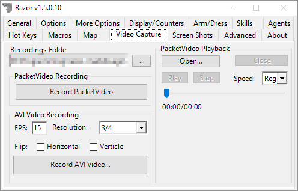

# Video Capture

This is a simple section that, at some level, has become obsolete 20 years after Ultima Online was released.

With modern day recording software. If you really want to record videos of Ultima Online, please look at a free tool like [Open Broadcaster Software](https://obsproject.com/) that lets you create high quality videos (1080p+) with overlays, for free.

## Packet Recording

Razor does support capturing packets, and replaying them back via the Ultima Online client.

## AVI Recording

As the name states, this will record AVIs. Again, it's probably not going to get the level of quality that you can get using tools.